## **EXPLANATORY DATA ANALYSIS (EDA) PROJECT: UFA THROWING STATISTICS**

## *Carnegie Mellon Sports Analytics Camp (CMSACamp) 2026*

### *An Le’s Data Exploration*

#### 0. Importing the dataset

``` r
rm(list = ls())

library(tidyverse)
```

    ── Attaching core tidyverse packages ──────────────────────── tidyverse 2.0.0 ──
    ✔ dplyr     1.2.1     ✔ readr     2.2.0
    ✔ forcats   1.0.1     ✔ stringr   1.6.0
    ✔ ggplot2   4.0.3     ✔ tibble    3.3.1
    ✔ lubridate 1.9.5     ✔ tidyr     1.3.2
    ✔ purrr     1.2.2     
    ── Conflicts ────────────────────────────────────────── tidyverse_conflicts() ──
    ✖ dplyr::filter() masks stats::filter()
    ✖ dplyr::lag()    masks stats::lag()
    ℹ Use the conflicted package (<http://conflicted.r-lib.org/>) to force all conflicts to become errors

``` r
ufa_throws <- read_csv("https://raw.githubusercontent.com/36-SURE/2026/main/data/ufa_throws.csv")
```

    Rows: 290826 Columns: 24
    ── Column specification ────────────────────────────────────────────────────────
    Delimiter: ","
    chr  (5): thrower, receiver, gameID, home_teamID, away_teamID
    dbl (18): thrower_x, thrower_y, receiver_x, receiver_y, turnover, possession...
    lgl  (1): is_home_team

    ℹ Use `spec()` to retrieve the full column specification for this data.
    ℹ Specify the column types or set `show_col_types = FALSE` to quiet this message.

``` r
head(ufa_throws)
```

    # A tibble: 6 × 24
      thrower thrower_x thrower_y receiver receiver_x receiver_y turnover
      <chr>       <dbl>     <dbl> <chr>         <dbl>      <dbl>    <dbl>
    1 jnissen      1.02      15.1 jmalks        -8.17       23.5        0
    2 jmalks      -8.17      23.5 jnissen        2.18       27.1        0
    3 jnissen      2.18      27.1 jmalks       -10.2        33.6        0
    4 jmalks     -10.2       33.6 jnissen       -3.94       26.8        0
    5 jnissen     -3.94      26.8 boort         13.0        36.3        0
    6 boort       13.0       36.3 jmalks         1.74       34.4        0
    # ℹ 17 more variables: possession_num <dbl>, possession_throw <dbl>,
    #   game_quarter <dbl>, is_home_team <lgl>, home_team_score <dbl>,
    #   away_team_score <dbl>, gameID <chr>, home_teamID <chr>, away_teamID <chr>,
    #   times <dbl>, home_team_win <dbl>, score_diff <dbl>, goal <dbl>,
    #   throw_distance <dbl>, x_diff <dbl>, y_diff <dbl>, throw_angle <dbl>

#### 1. Exploring goal and turnover data

Relationship of each variable to whether a throw results in a goal:

``` r
goal_throws <- ufa_throws |>
  filter(goal == 1)

failed_throws <- ufa_throws |>
  filter(goal == 0 & turnover == 1)

pass_throws <- ufa_throws |>
  filter(goal == 0 & turnover == 0)

goal_throws
```

    # A tibble: 21,391 × 24
       thrower   thrower_x thrower_y receiver  receiver_x receiver_y turnover
       <chr>         <dbl>     <dbl> <chr>          <dbl>      <dbl>    <dbl>
     1 mmcdonnel     -8.09      89.8 jmalks        -15.4        105.        0
     2 tedmonds     -13.3       68.8 afall          -8.38       108.        0
     3 jtaylor1     -20.2       96   pboerth       -14.8        110.        0
     4 boort        -20.6       82.1 jwodatch1     -22.2        105.        0
     5 tchan          2.41      65.8 pboerth       -17.1        107.        0
     6 ndick        -24.3       46   rlinehan      -17.8        102.        0
     7 cboxley      -21.9       89.5 jwodatch1     -14.3        107.        0
     8 csunde       -15.4       44.2 tchan         -10.2        111.        0
     9 jnissen       24.3       92.0 boort          21.7        102.        0
    10 tchan         -3.71      35.4 pboerth         9.96       105.        0
    # ℹ 21,381 more rows
    # ℹ 17 more variables: possession_num <dbl>, possession_throw <dbl>,
    #   game_quarter <dbl>, is_home_team <lgl>, home_team_score <dbl>,
    #   away_team_score <dbl>, gameID <chr>, home_teamID <chr>, away_teamID <chr>,
    #   times <dbl>, home_team_win <dbl>, score_diff <dbl>, goal <dbl>,
    #   throw_distance <dbl>, x_diff <dbl>, y_diff <dbl>, throw_angle <dbl>

``` r
failed_throws
```

    # A tibble: 19,839 × 24
       thrower   thrower_x thrower_y receiver  receiver_x receiver_y turnover
       <chr>         <dbl>     <dbl> <chr>          <dbl>      <dbl>    <dbl>
     1 tchan          2.74      95.5 cdavisbra      -7.2        99.4        1
     2 mmcdonnel     -8.89      41.5 <NA>          -21.9        71.3        1
     3 skelley1      19.0       66   <NA>          -14.0        75.4        1
     4 cdavisbra     -1         41.5 <NA>           10.9        61.2        1
     5 dbloodgoo    -25.6       55.2 amerriman      -2.41       49.5        1
     6 cboxley       16.5       88.8 <NA>           19.4       105.         1
     7 mmcdonnel      3.42      32.4 <NA>            5.53       49.8        1
     8 lharwood     -14.9       91.9 bmccann       -19.3       101.         1
     9 cdavisbra    -13.6       16.4 <NA>           -5.2        91.0        1
    10 cboxley       -9.7       58.5 <NA>            5.17       57.7        1
    # ℹ 19,829 more rows
    # ℹ 17 more variables: possession_num <dbl>, possession_throw <dbl>,
    #   game_quarter <dbl>, is_home_team <lgl>, home_team_score <dbl>,
    #   away_team_score <dbl>, gameID <chr>, home_teamID <chr>, away_teamID <chr>,
    #   times <dbl>, home_team_win <dbl>, score_diff <dbl>, goal <dbl>,
    #   throw_distance <dbl>, x_diff <dbl>, y_diff <dbl>, throw_angle <dbl>

``` r
pass_throws
```

    # A tibble: 249,596 × 24
       thrower thrower_x thrower_y receiver receiver_x receiver_y turnover
       <chr>       <dbl>     <dbl> <chr>         <dbl>      <dbl>    <dbl>
     1 jnissen      1.02      15.1 jmalks        -8.17       23.5        0
     2 jmalks      -8.17      23.5 jnissen        2.18       27.1        0
     3 jnissen      2.18      27.1 jmalks       -10.2        33.6        0
     4 jmalks     -10.2       33.6 jnissen       -3.94       26.8        0
     5 jnissen     -3.94      26.8 boort         13.0        36.3        0
     6 boort       13.0       36.3 jmalks         1.74       34.4        0
     7 jmalks       1.74      34.4 jnissen       -9.33       33.1        0
     8 jnissen     -9.33      33.1 khealey       -5.4        45.1        0
     9 khealey     -5.4       45.1 jnissen      -11.8        44.8        0
    10 jnissen    -11.8       44.8 cboxley       -0.08       44.3        0
    # ℹ 249,586 more rows
    # ℹ 17 more variables: possession_num <dbl>, possession_throw <dbl>,
    #   game_quarter <dbl>, is_home_team <lgl>, home_team_score <dbl>,
    #   away_team_score <dbl>, gameID <chr>, home_teamID <chr>, away_teamID <chr>,
    #   times <dbl>, home_team_win <dbl>, score_diff <dbl>, goal <dbl>,
    #   throw_distance <dbl>, x_diff <dbl>, y_diff <dbl>, throw_angle <dbl>

Goal distance histogram (goal vs no goal):

``` r
goal_throws |>
  ggplot(aes(x = throw_distance)) +
  geom_histogram()
```

    `stat_bin()` using `bins = 30`. Pick better value `binwidth`.

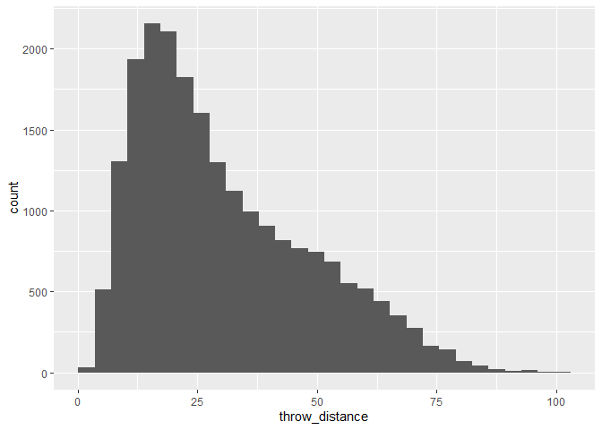

``` r
failed_throws |>
  ggplot(aes(x = throw_distance)) +
  geom_histogram()
```

    `stat_bin()` using `bins = 30`. Pick better value `binwidth`.

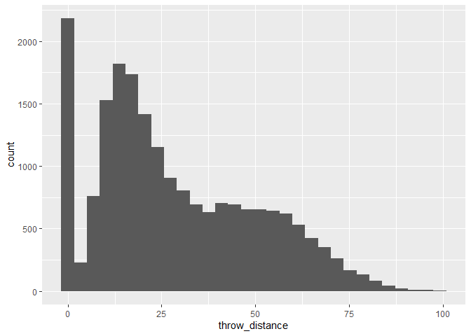

``` r
pass_throws |>
  ggplot(aes(x = throw_distance)) +
  geom_histogram()
```

    `stat_bin()` using `bins = 30`. Pick better value `binwidth`.

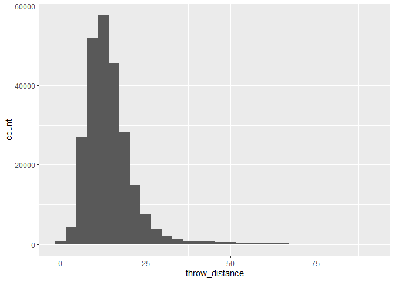

``` r
goal_throws |>
  ggplot(aes(x = throw_angle)) +
  geom_histogram() +
  coord_polar()
```

    `stat_bin()` using `bins = 30`. Pick better value `binwidth`.

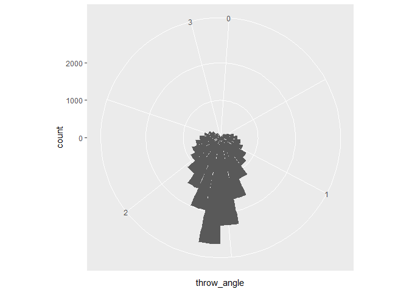

``` r
failed_throws |>
  ggplot(aes(x = throw_angle)) +
  geom_histogram() +
  coord_polar()
```

    `stat_bin()` using `bins = 30`. Pick better value `binwidth`.

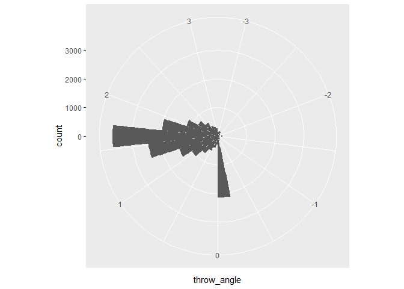

``` r
pass_throws |>
  ggplot(aes(x = throw_angle)) +
  geom_histogram() +
  coord_polar()
```

    `stat_bin()` using `bins = 30`. Pick better value `binwidth`.

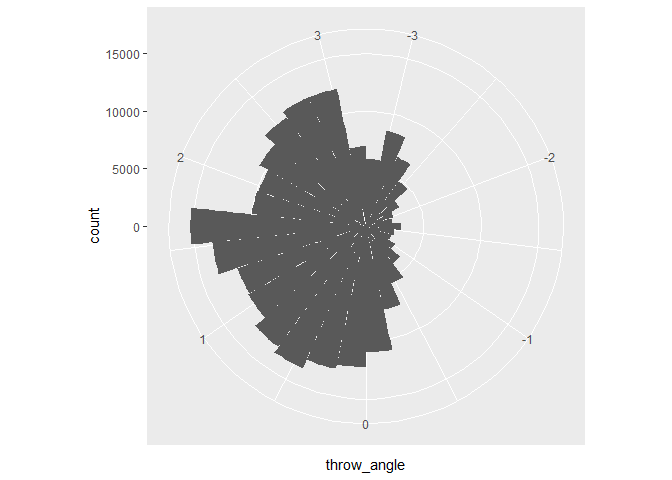

Coordinates of goal starting and ending points:

``` r
# Scatter plot does not make too much sense
goal_throws |>
  ggplot(aes(x = thrower_x, y = thrower_y)) +
  geom_point() +
  coord_fixed() +
  scale_x_continuous(limits = c(min(ufa_throws$thrower_x), max(ufa_throws$thrower_x))) +
  scale_y_continuous(limits = c(0, 120))
```

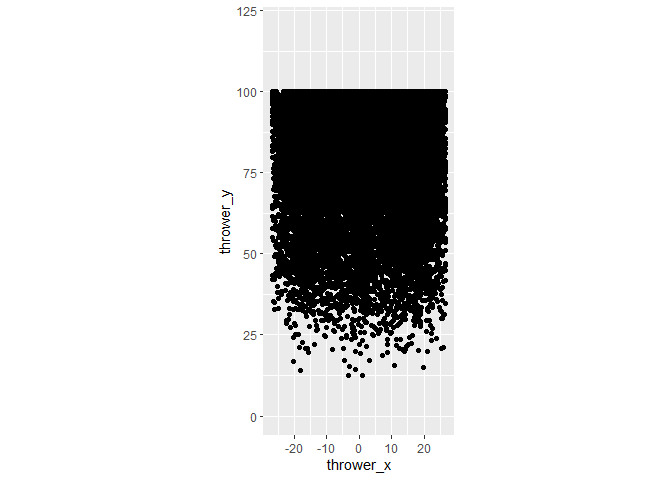

``` r
# What about box plots?
goal_throws |>
  ggplot(aes(x = thrower_x)) +
  geom_boxplot() +
  scale_x_continuous(limits = c(-30, 30))
```

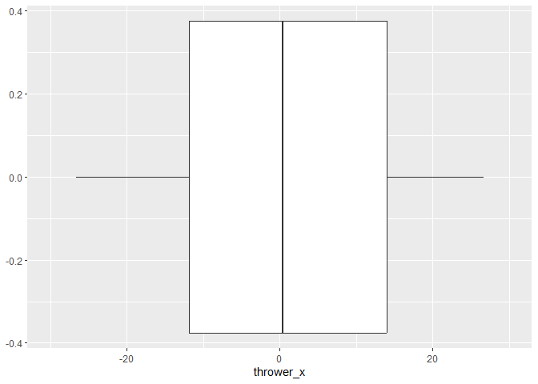

``` r
goal_throws |>
  ggplot(aes(y = thrower_y)) +
  geom_boxplot() +
  scale_y_continuous(limits = c(0, 120))
```

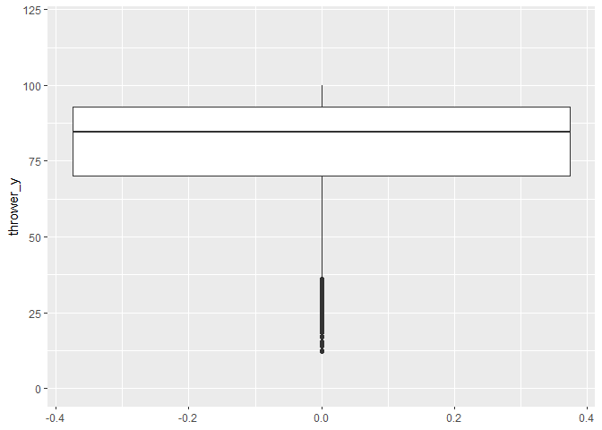

How many throws lead to a goal?

``` r
goal_throws |>
  ggplot(aes(x = possession_throw)) +
  stat_ecdf() +
  scale_x_continuous(breaks = seq(0, 65, 5))
```

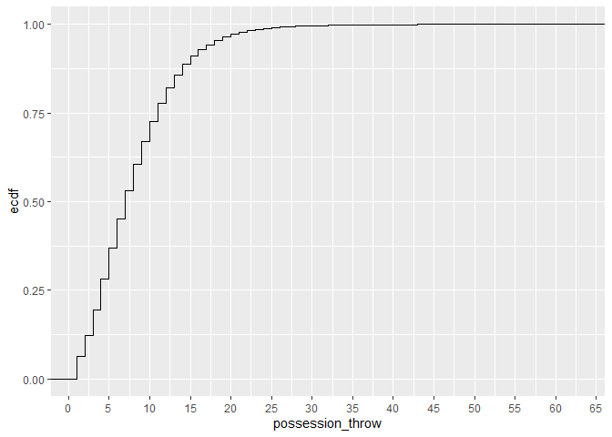

``` r
# Around 70% of goals are created with <= 10 throws, and >50% of goals are created with <= 8 throws
```

Drawing arrows in ggplot2: `geom_segment`:
https://r-graph-gallery.com/415-arrows-in-ggplot-graph.html

``` r
goal_throws |>
  # Filter for a specific match for simplicity
  # Can uncomment the filter lines if needed
  filter(gameID == "2023-06-24-DC-BOS") |>
  ggplot() +
  geom_segment(aes(x = thrower_x, y = thrower_y,
                   xend = receiver_x, yend = receiver_y),
               arrow = arrow(), linewidth = 0.5) +
  coord_fixed()
```

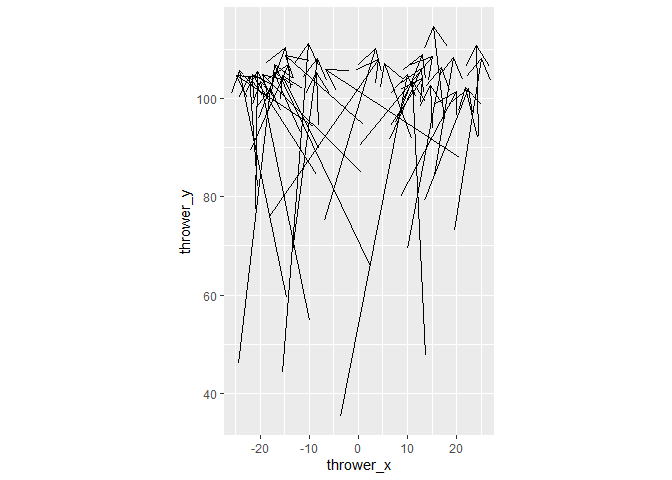

What about a particular sequence of shots that lead to a goal?

``` r
ufa_throws |>
  filter(gameID == "2023-06-24-DC-BOS" & times >= 2815) |>
  ggplot() +
  geom_segment(aes(x = thrower_x, y = thrower_y,
                   xend = receiver_x, yend = receiver_y),
               arrow = arrow(), linewidth = 0.5) +
  coord_fixed()
```

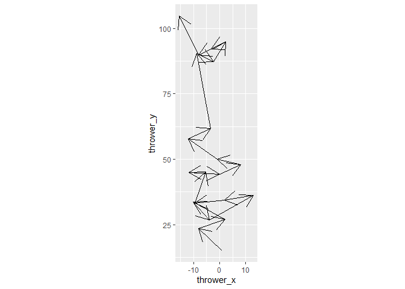

Try creating a heat map of position of goal throws by quarter:

``` r
# https://sportscidata.com/2019/03/26/how-to-create-gps-heatmaps-in-ggplot/
# https://r-charts.com/correlation/contour-plot-ggplot2/

goal_throws |>
  ggplot(aes(x = thrower_x, y = thrower_y)) +
  geom_density_2d_filled() +
  scale_x_continuous(limits = c(-(26+2/3), 26+2/3)) +
  #scale_y_continuous(limits = c(0, 120)) +
  # Here we zoom in the "after-midpoint" position of the field
  scale_y_continuous(limits = c(60, 110)) +
  coord_fixed() + scale_fill_viridis_d() +
  theme(legend.position = "none") +
  geom_hline(yintercept = 100, color = "white") +
  facet_wrap(~ game_quarter, nrow = 2, ncol = 3)
```

    Warning: Removed 3362 rows containing non-finite outside the scale range
    (`stat_density2d_filled()`).

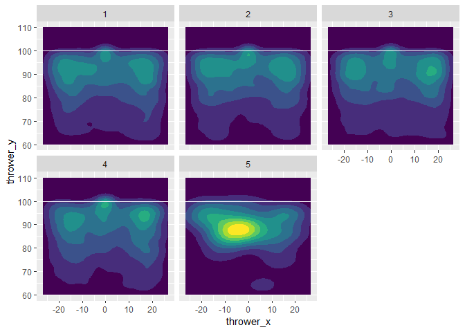

Now do the same with the throws that make a turnover:

``` r
failed_throws |>
  ggplot() +
  geom_density_2d_filled(aes(x = thrower_x, y = thrower_y)) +
  geom_point(aes(x = receiver_x, y = receiver_y), color = "red",
             alpha = 0.2, shape = 4, size = 0.5) +
  scale_x_continuous(limits = c(-(26+2/3), 26+2/3)) +
  scale_y_continuous(limits = c(0, 120)) +
  coord_fixed() + scale_fill_viridis_d() +
  theme(legend.position = "none") +
  geom_hline(yintercept = 20, color = "white") +
  geom_hline(yintercept = 100, color = "white") +
  facet_wrap(~ game_quarter, nrow = 1, ncol = 6)
```

    Warning: Removed 95 rows containing non-finite outside the scale range
    (`stat_density2d_filled()`).

    Warning: Removed 157 rows containing missing values or values outside the scale range
    (`geom_point()`).

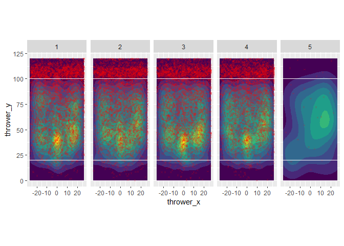

Probability from scoring a goal and making a turnover from a certain
coordinate along the y-axis:

``` r
ufa_goal_turnover <- ufa_throws |>
  select(thrower_y, goal, turnover) |>
  mutate(zone = case_when(0 <= thrower_y & thrower_y <= 20 ~ "own_end_zone",
                          thrower_y > 20 & thrower_y <= 60 ~ "before_midpoint",
                          thrower_y > 60 ~ "after_midpoint"))

goal_from_zones <- ufa_goal_turnover |>
  select(zone, goal) |>
  group_by(zone) |>
  summarize(total_goals = sum(goal)) |>
  mutate(proportion = total_goals / sum(total_goals))

turnover_from_zones <- ufa_goal_turnover |>
  select(zone, turnover) |>
  group_by(zone) |>
  summarize(total_turnovers = sum(turnover)) |>
  mutate(proportion = total_turnovers / sum(total_turnovers))

goal_from_zones
```

    # A tibble: 3 × 3
      zone            total_goals proportion
      <chr>                 <dbl>      <dbl>
    1 after_midpoint        18043   0.843   
    2 before_midpoint        3332   0.156   
    3 own_end_zone             16   0.000748

``` r
turnover_from_zones
```

    # A tibble: 3 × 3
      zone            total_turnovers proportion
      <chr>                     <dbl>      <dbl>
    1 after_midpoint             7860     0.396 
    2 before_midpoint           10839     0.546 
    3 own_end_zone               1140     0.0575

Throw distance based on the current team’s lead:

``` r
throw_dist_lead <- ufa_throws |>
  # Select both successful and unsuccessful throws
  select(throw_distance, is_home_team, score_diff) |>
  # Note that score_diff = score_home - score_away.
  # If the current team is not the home team, then we need to flip the signs
  mutate(adjusted_score_diff =
           case_when(is_home_team == TRUE ~ score_diff,
                     is_home_team == FALSE ~ (-1) * score_diff)) |>
  # Compute the median throwing distance with each score difference
  select(adjusted_score_diff, throw_distance) |>
  group_by(adjusted_score_diff) |>
  summarize(median_throw_distance = median(throw_distance))

throw_dist_lead
```

    # A tibble: 49 × 2
       adjusted_score_diff median_throw_distance
                     <dbl>                 <dbl>
     1                 -24                 12.8 
     2                 -23                 17.0 
     3                 -22                 12.0 
     4                 -21                 10.8 
     5                 -20                  7.66
     6                 -19                 13.4 
     7                 -18                 13.1 
     8                 -17                 15.3 
     9                 -16                 14.5 
    10                 -15                 13.7 
    # ℹ 39 more rows

``` r
throw_dist_lead |>
  ggplot(aes(x = adjusted_score_diff, y = median_throw_distance)) +
  geom_point() +
  geom_vline(xintercept = 0, linetype = "dashed", color = "red", linewidth = 1) +
  geom_smooth()
```

    `geom_smooth()` using method = 'loess' and formula = 'y ~ x'

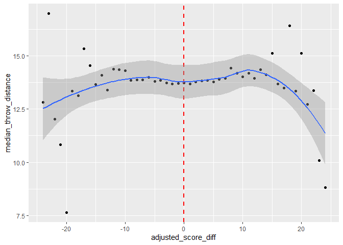

What if we only keep the successful throws?

``` r
adjusted_throw_dist_lead <- ufa_throws |>
  filter(turnover == 0) |>
  select(throw_distance, is_home_team, score_diff) |>
  # Note that score_diff = score_home - score_away.
  # If the current team is not the home team, then we need to flip the signs
  mutate(adjusted_score_diff =
           case_when(is_home_team == TRUE ~ score_diff,
                     is_home_team == FALSE ~ (-1) * score_diff)) |>
  # Compute the median throwing distance with each score difference
  select(adjusted_score_diff, throw_distance) |>
  group_by(adjusted_score_diff) |>
  summarize(median_throw_distance = median(throw_distance))

adjusted_throw_dist_lead
```

    # A tibble: 49 × 2
       adjusted_score_diff median_throw_distance
                     <dbl>                 <dbl>
     1                 -24                 12.0 
     2                 -23                 11.2 
     3                 -22                 11.1 
     4                 -21                 10.8 
     5                 -20                  7.66
     6                 -19                 13.4 
     7                 -18                 13.0 
     8                 -17                 14.2 
     9                 -16                 14.2 
    10                 -15                 13.5 
    # ℹ 39 more rows

``` r
adjusted_throw_dist_lead |>
  ggplot(aes(x = adjusted_score_diff, y = median_throw_distance)) +
  geom_point() +
  geom_vline(xintercept = 0, linetype = "dashed", color = "red", linewidth = 1) +
  geom_smooth()
```

    `geom_smooth()` using method = 'loess' and formula = 'y ~ x'

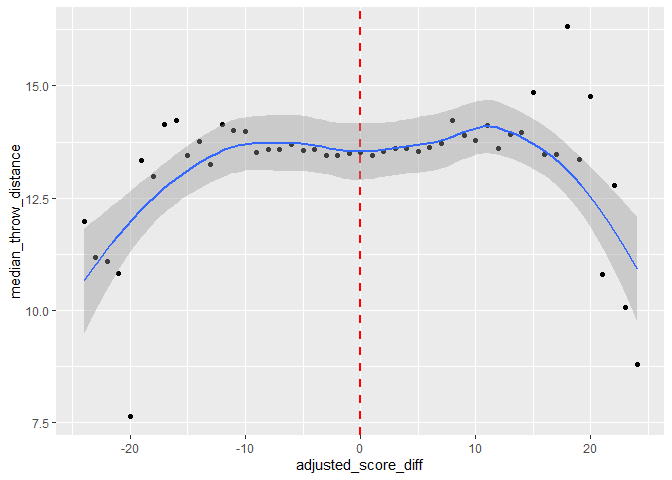

What if we adjust the dataset so that we are interested in how much
higher up the field that the throw progressed?

``` r
adjusted_throw_dist_lead_2 <- ufa_throws |>
  select(y_diff, is_home_team, score_diff) |>
  mutate(adjusted_score_diff =
           case_when(is_home_team == TRUE ~ score_diff,
                     is_home_team == FALSE ~ (-1) * score_diff)) |>
  # Compute the median throwing distance with each score difference
  select(adjusted_score_diff, y_diff) |>
  group_by(adjusted_score_diff) |>
  summarize(mean_y_diff = mean(y_diff))

adjusted_throw_dist_lead_2
```

    # A tibble: 49 × 2
       adjusted_score_diff mean_y_diff
                     <dbl>       <dbl>
     1                 -24       11.6 
     2                 -23       22.2 
     3                 -22       10.3 
     4                 -21        8.08
     5                 -20        5.75
     6                 -19        7.92
     7                 -18        7.83
     8                 -17       10.8 
     9                 -16        7.37
    10                 -15        7.96
    # ℹ 39 more rows

``` r
adjusted_throw_dist_lead_2 |>
  ggplot(aes(x = adjusted_score_diff, y = mean_y_diff)) +
  geom_point() +
  geom_vline(xintercept = 0, linetype = "dashed", color = "red", linewidth = 1) +
  geom_smooth()
```

    `geom_smooth()` using method = 'loess' and formula = 'y ~ x'

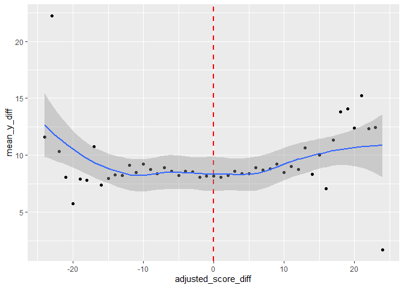

Most of the failed passes (leading to the turnover) come before the
midpoint, while the vast majority of the goal comes after the midpoint!

=\> How can teams break through the midpoint to score goals?

Note that field dimensions in ultimate frisbee may differ by tournaments
and styles of play. In UFA, the field is 53+(1/3) yards wide and 80
yards long plus 20 yard endzones.

The UFA rulebook:
https://watchufa.com/sites/default/files/UFA%20Rule%20Book%202024%20v12.0.pdf

#### 2. Exploring team results data

Which team appears the most in the dataset? (Removing entries for
duplicated matches)

``` r
# https://tidyr.tidyverse.org/reference/separate.html
# https://tidyr.tidyverse.org/reference/separate_wider_delim.html

# https://www.geeksforgeeks.org/r-language/concatenate-two-strings-in-r-programming-paste-method/

match_data <- ufa_throws |>
  select(gameID, home_teamID, away_teamID, home_team_win) |>
  distinct(gameID, .keep_all = TRUE) |>
  tidyr::separate_wider_delim(gameID, delim = "-",
                              names = c("game_year", "game_month", "game_date",
                                        NA, NA)) |>
  mutate(winner = case_when(home_team_win == 0 ~ away_teamID,
                            home_team_win == 1 ~ home_teamID),
         loser = case_when(winner == home_teamID ~ away_teamID,
                           winner == away_teamID ~ home_teamID),
         game_full_date = paste(game_year, game_month, game_date, sep = "-")) |>
  mutate(game_full_date = as.Date(game_full_date, "%Y-%m-%d")) |>
  select(game_full_date, home_teamID, away_teamID, winner, loser) |>
  arrange(game_full_date)

match_data
```

    # A tibble: 574 × 5
       game_full_date home_teamID  away_teamID winner    loser       
       <date>         <chr>        <chr>       <chr>     <chr>       
     1 2021-06-04     alleycats    mechanix    alleycats mechanix    
     2 2021-06-04     phoenix      cannons     phoenix   cannons     
     3 2021-06-04     radicals     windchill   windchill radicals    
     4 2021-06-05     union        alleycats   union     alleycats   
     5 2021-06-05     breeze       cannons     breeze    cannons     
     6 2021-06-05     aviators     growlers    growlers  aviators    
     7 2021-06-05     cascades     spiders     cascades  spiders     
     8 2021-06-05     thunderbirds glory       glory     thunderbirds
     9 2021-06-05     mechanix     radicals    radicals  mechanix    
    10 2021-06-11     glory        hustle      hustle    glory       
    # ℹ 564 more rows

``` r
summary(match_data$game_full_date)
```

            Min.      1st Qu.       Median         Mean      3rd Qu.         Max. 
    "2021-06-04" "2022-05-13" "2023-05-05" "2023-01-15" "2024-04-27" "2024-08-24" 

June 4, 2021 is the first day of regular season of the 2021 season.
August 24, 2024 is the championship game of the 2024 season.

https://www.watchufa.com/league/news/2021-audl-game-preview-week-1-minnesota-wind-chill-madison-radicals

https://www.watchufa.com/league/news/2024-ufa-playoffs-schedule

``` r
home_appearances <- match_data |>
  count(home_teamID)

away_appearances <- match_data |>
  count(away_teamID)

# There is also an "allstar" game, which is useful to remove in this case
total_appearances <- home_appearances |>
  full_join(away_appearances, join_by(home_teamID == away_teamID),
            suffix = c("_home", "_away")) |>
  mutate(total_matches = n_home + n_away) |>
  rename(teamID = home_teamID) |>
  filter(!(teamID %in% c("allstars1", "allstars2")))

total_appearances
```

    # A tibble: 26 × 4
       teamID    n_home n_away total_matches
       <chr>      <int>  <int>         <int>
     1 alleycats     24     26            50
     2 aviators      23     23            46
     3 breeze        26     24            50
     4 cannons       12     12            24
     5 cascades      26     23            49
     6 empire        30     23            53
     7 flyers        26     27            53
     8 glory         24     26            50
     9 growlers      25     25            50
    10 havoc         12     11            23
    # ℹ 16 more rows

``` r
# Pivoting and plotting as a facet
total_appearances_pivot <- total_appearances |>
  pivot_longer(n_home:total_matches,
               names_to = "match_type", values_to = "count") |>
  filter(match_type != "total_matches")

total_appearances_pivot
```

    # A tibble: 52 × 3
       teamID    match_type count
       <chr>     <chr>      <int>
     1 alleycats n_home        24
     2 alleycats n_away        26
     3 aviators  n_home        23
     4 aviators  n_away        23
     5 breeze    n_home        26
     6 breeze    n_away        24
     7 cannons   n_home        12
     8 cannons   n_away        12
     9 cascades  n_home        26
    10 cascades  n_away        23
    # ℹ 42 more rows

``` r
total_appearances_pivot |>
  ggplot(aes(x = teamID, y = count, fill = match_type)) +
  geom_col(position = "dodge") +
  # Change position of legend to bottom, rotate x-axis labels by 45 degrees
  theme(legend.position = "bottom",
        axis.text.x = element_text(angle = 45,
                                   vjust = 1, hjust = 1))
```

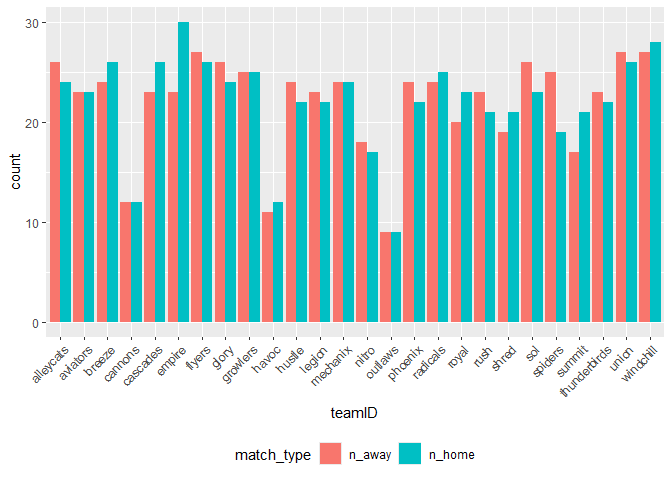

``` r
  #facet_grid(match_type ~ .)
```

What about the number of wins or losses?

``` r
win_counts <- match_data |>
  count(winner)

loss_counts <- match_data |>
  count(loser)

# There is also an "allstar" game, which is useful to remove in this case
overall_stats <- win_counts |>
  left_join(loss_counts, join_by(winner == loser),
            suffix = c("_wins", "_losses")) |>
  mutate(total_matches = n_wins + n_losses) |>
  rename(teamID = winner) |>
  filter(!(teamID %in% c("allstars1", "allstars2")))

overall_stats
```

    # A tibble: 26 × 4
       teamID    n_wins n_losses total_matches
       <chr>      <int>    <int>         <int>
     1 alleycats     23       27            50
     2 aviators      19       27            46
     3 breeze        40       10            50
     4 cannons        3       21            24
     5 cascades      20       29            49
     6 empire        45        8            53
     7 flyers        41       12            53
     8 glory         25       25            50
     9 growlers      27       23            50
    10 havoc          8       15            23
    # ℹ 16 more rows

``` r
# Same as the previous use case
overall_stats_pivot <- overall_stats |>
  pivot_longer(n_wins:total_matches,
               names_to = "outcome", values_to = "count") |>
  filter(outcome != "total_matches")

overall_stats_pivot
```

    # A tibble: 52 × 3
       teamID    outcome  count
       <chr>     <chr>    <int>
     1 alleycats n_wins      23
     2 alleycats n_losses    27
     3 aviators  n_wins      19
     4 aviators  n_losses    27
     5 breeze    n_wins      40
     6 breeze    n_losses    10
     7 cannons   n_wins       3
     8 cannons   n_losses    21
     9 cascades  n_wins      20
    10 cascades  n_losses    29
    # ℹ 42 more rows

``` r
overall_stats_pivot |>
  ggplot(aes(x = teamID, y = count, fill = outcome)) +
  geom_col(position = "dodge") +
  # Change position of legend to bottom, rotate x-axis labels by 45 degrees
  theme(legend.position = "bottom",
        axis.text.x = element_text(angle = 45,
                                   vjust = 1, hjust = 1))
```

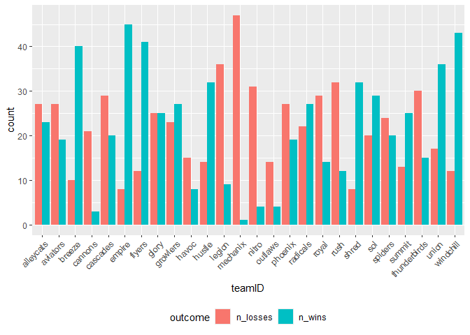

``` r
  #facet_grid(match_type ~ .)
```

``` r
# How about the win percentage?
overall_stats_win_pct <- overall_stats |>
  mutate(win_percentage = n_wins / total_matches,
# Use example from Lecture 3, mutate to display it properly in the following plot
         teamID = fct_reorder(teamID, win_percentage, .desc = TRUE)) |>
  arrange(desc(win_percentage))

overall_stats_win_pct
```

    # A tibble: 26 × 5
       teamID    n_wins n_losses total_matches win_percentage
       <fct>      <int>    <int>         <int>          <dbl>
     1 empire        45        8            53          0.849
     2 breeze        40       10            50          0.8  
     3 shred         32        8            40          0.8  
     4 windchill     43       12            55          0.782
     5 flyers        41       12            53          0.774
     6 hustle        32       14            46          0.696
     7 union         36       17            53          0.679
     8 summit        25       13            38          0.658
     9 sol           29       20            49          0.592
    10 radicals      27       22            49          0.551
    # ℹ 16 more rows

``` r
overall_stats_win_pct |>
  ggplot(aes(x = teamID, y = win_percentage)) +
  geom_col() +
  theme(axis.text.x = element_text(angle = 45, vjust = 1, hjust = 1))
```

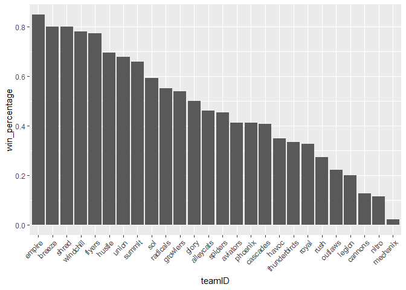

#### 3. Proposed questions

1.  Which direction of attack (i.e. to the right or left side of the
    field) has more chances of scoring a goal? Does this vary across
    teams?

2.  What makes a team attempt further throws, or attempt to score goals
    with fewer passes? Is it the time pressure (little time left in
    quarter or the match), or the score pressure (being led by so many
    points)?

3.  For all teams’ possession period that builds up from before the
    midpoint and passing through the midpoint, how likely is a team to
    score goals afterwards?

4.  Explore questions on how a particular team’s throwing strategies
    evolved over time, or how a particular tournament-wide statistic has
    changed over time:

- Number of throws that make a goal / throw distance of a goal / total
  time that it takes for teams to score goals
- Whether teams attack more on the left wing or on the right wing
- Locations of turnovers (how far has a team gone up the field when they
  made a turnover?)

“Over time” can mean comparing between quarters, between different
seasons, or between regular season and playoffs (need additional
research and data processing).

5.  Clustering analysis: Cluster teams by the attacking strategy
    (starting vertical half, ending vertical half, number of times that
    the team switch vertical halves).

6.  Can also repeat these questions but for a particular team (eg:
    Pittsburgh Thunderbirds) to analyze in depth and suggest strategies.
