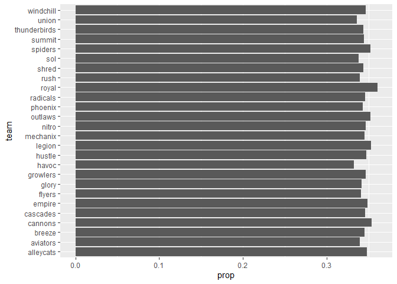
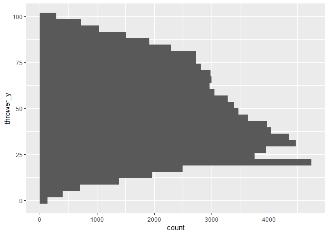
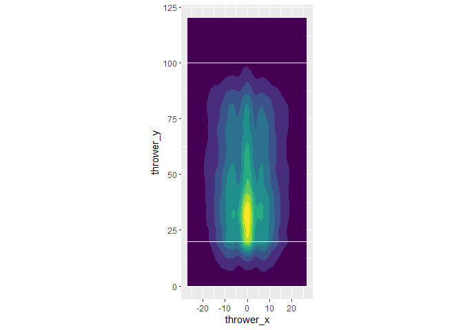
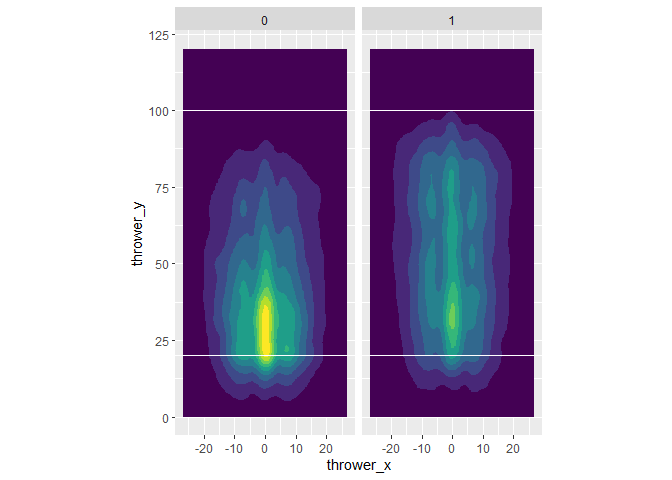
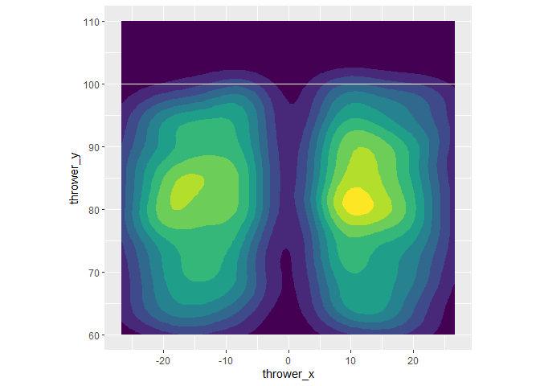
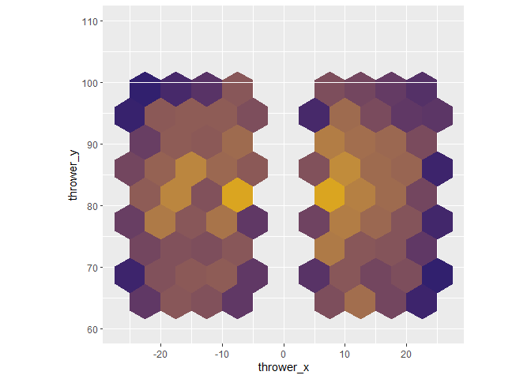
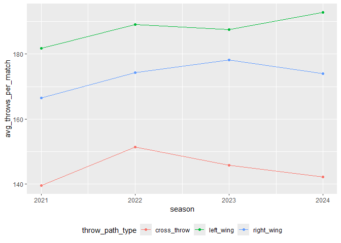

#### 0. Importing the dataset

``` r
rm(list = ls())

library(tidyverse)
```

    ── Attaching core tidyverse packages ──────────────────────── tidyverse 2.0.0 ──
    ✔ dplyr     1.2.1     ✔ readr     2.2.0
    ✔ forcats   1.0.1     ✔ stringr   1.6.0
    ✔ ggplot2   4.0.3     ✔ tibble    3.3.1
    ✔ lubridate 1.9.5     ✔ tidyr     1.3.2
    ✔ purrr     1.2.2     
    ── Conflicts ────────────────────────────────────────── tidyverse_conflicts() ──
    ✖ dplyr::filter() masks stats::filter()
    ✖ dplyr::lag()    masks stats::lag()
    ℹ Use the conflicted package (<http://conflicted.r-lib.org/>) to force all conflicts to become errors

``` r
ufa_throws <- read_csv("https://raw.githubusercontent.com/36-SURE/2026/main/data/ufa_throws.csv")
```

    Rows: 290826 Columns: 24
    ── Column specification ────────────────────────────────────────────────────────
    Delimiter: ","
    chr  (5): thrower, receiver, gameID, home_teamID, away_teamID
    dbl (18): thrower_x, thrower_y, receiver_x, receiver_y, turnover, possession...
    lgl  (1): is_home_team

    ℹ Use `spec()` to retrieve the full column specification for this data.
    ℹ Specify the column types or set `show_col_types = FALSE` to quiet this message.

``` r
ufa_throws
```

    # A tibble: 290,826 × 24
       thrower thrower_x thrower_y receiver receiver_x receiver_y turnover
       <chr>       <dbl>     <dbl> <chr>         <dbl>      <dbl>    <dbl>
     1 jnissen      1.02      15.1 jmalks        -8.17       23.5        0
     2 jmalks      -8.17      23.5 jnissen        2.18       27.1        0
     3 jnissen      2.18      27.1 jmalks       -10.2        33.6        0
     4 jmalks     -10.2       33.6 jnissen       -3.94       26.8        0
     5 jnissen     -3.94      26.8 boort         13.0        36.3        0
     6 boort       13.0       36.3 jmalks         1.74       34.4        0
     7 jmalks       1.74      34.4 jnissen       -9.33       33.1        0
     8 jnissen     -9.33      33.1 khealey       -5.4        45.1        0
     9 khealey     -5.4       45.1 jnissen      -11.8        44.8        0
    10 jnissen    -11.8       44.8 cboxley       -0.08       44.3        0
    # ℹ 290,816 more rows
    # ℹ 17 more variables: possession_num <dbl>, possession_throw <dbl>,
    #   game_quarter <dbl>, is_home_team <lgl>, home_team_score <dbl>,
    #   away_team_score <dbl>, gameID <chr>, home_teamID <chr>, away_teamID <chr>,
    #   times <dbl>, home_team_win <dbl>, score_diff <dbl>, goal <dbl>,
    #   throw_distance <dbl>, x_diff <dbl>, y_diff <dbl>, throw_angle <dbl>

``` r
# Flipping the dataset so that positive x is the right side and negative x is the left side
ufa_throws <- ufa_throws |>
  mutate(thrower_x = (-1) * thrower_x,
         receiver_x = (-1) * receiver_x,
         throw_distance = sqrt((receiver_x-thrower_x)^2 + (receiver_y-thrower_y)^2),
         x_diff = receiver_x - thrower_x,
         throw_angle = atan2(y_diff, x_diff))

ufa_throws
```

    # A tibble: 290,826 × 24
       thrower thrower_x thrower_y receiver receiver_x receiver_y turnover
       <chr>       <dbl>     <dbl> <chr>         <dbl>      <dbl>    <dbl>
     1 jnissen     -1.02      15.1 jmalks         8.17       23.5        0
     2 jmalks       8.17      23.5 jnissen       -2.18       27.1        0
     3 jnissen     -2.18      27.1 jmalks        10.2        33.6        0
     4 jmalks      10.2       33.6 jnissen        3.94       26.8        0
     5 jnissen      3.94      26.8 boort        -13.0        36.3        0
     6 boort      -13.0       36.3 jmalks        -1.74       34.4        0
     7 jmalks      -1.74      34.4 jnissen        9.33       33.1        0
     8 jnissen      9.33      33.1 khealey        5.4        45.1        0
     9 khealey      5.4       45.1 jnissen       11.8        44.8        0
    10 jnissen     11.8       44.8 cboxley        0.08       44.3        0
    # ℹ 290,816 more rows
    # ℹ 17 more variables: possession_num <dbl>, possession_throw <dbl>,
    #   game_quarter <dbl>, is_home_team <lgl>, home_team_score <dbl>,
    #   away_team_score <dbl>, gameID <chr>, home_teamID <chr>, away_teamID <chr>,
    #   times <dbl>, home_team_win <dbl>, score_diff <dbl>, goal <dbl>,
    #   throw_distance <dbl>, x_diff <dbl>, y_diff <dbl>, throw_angle <dbl>

``` r
# Filtering for successful throws
successful_throws <- ufa_throws |>
  filter(turnover == 0)

successful_throws
```

    # A tibble: 270,987 × 24
       thrower thrower_x thrower_y receiver receiver_x receiver_y turnover
       <chr>       <dbl>     <dbl> <chr>         <dbl>      <dbl>    <dbl>
     1 jnissen     -1.02      15.1 jmalks         8.17       23.5        0
     2 jmalks       8.17      23.5 jnissen       -2.18       27.1        0
     3 jnissen     -2.18      27.1 jmalks        10.2        33.6        0
     4 jmalks      10.2       33.6 jnissen        3.94       26.8        0
     5 jnissen      3.94      26.8 boort        -13.0        36.3        0
     6 boort      -13.0       36.3 jmalks        -1.74       34.4        0
     7 jmalks      -1.74      34.4 jnissen        9.33       33.1        0
     8 jnissen      9.33      33.1 khealey        5.4        45.1        0
     9 khealey      5.4       45.1 jnissen       11.8        44.8        0
    10 jnissen     11.8       44.8 cboxley        0.08       44.3        0
    # ℹ 270,977 more rows
    # ℹ 17 more variables: possession_num <dbl>, possession_throw <dbl>,
    #   game_quarter <dbl>, is_home_team <lgl>, home_team_score <dbl>,
    #   away_team_score <dbl>, gameID <chr>, home_teamID <chr>, away_teamID <chr>,
    #   times <dbl>, home_team_win <dbl>, score_diff <dbl>, goal <dbl>,
    #   throw_distance <dbl>, x_diff <dbl>, y_diff <dbl>, throw_angle <dbl>

#### Main question:

**Which direction of attack (i.e. to the right or left side of the
field) has more chances of scoring a goal? Does this vary across
teams?**

See the `01_data_exploration.qmd` files for:

- Heat map for the directions of scoring a goal (faceted by quarter)
- Example of a sequence of throws that lead to a goal

Note: A sequence of throws eventually leading to a turnover/goal is
(hopefully) uniquely determined by the following variables:

- Possession number
- Game quarter
- Team in possession (`if_home_team`)
- Current scores of home and away teams
- Game ID

#### 1. Number of throws made in a particular wing of the field or crossed the midfield (successful throws only)

``` r
successful_throws |>
  mutate(throw_path_type = case_when(
    (thrower_x >= 0) & (receiver_x >= 0) ~ "right_wing",
    (thrower_x <= 0) & (receiver_x <= 0) ~ "left_wing",
    (thrower_x >= 0) & (receiver_x <= 0) ~ "right_to_left",
    (thrower_x <= 0) & (receiver_x >= 0) ~ "left_to_right"
  )) |>
  count(throw_path_type) |>
  mutate(prop = n / sum(n))
```

    # A tibble: 4 × 3
      throw_path_type      n  prop
      <chr>            <int> <dbl>
    1 left_to_right    38938 0.144
    2 left_wing       100186 0.370
    3 right_to_left    39280 0.145
    4 right_wing       92583 0.342

#### 1.1. Additional filter step for successful attacking phases (those that result in a goal)

``` r
# Create a list of attacking phases that result in a goal
successful_goals_indicators <- ufa_throws |>
  filter(goal == 1) |>
  select(gameID, game_quarter, is_home_team, possession_num,
         home_team_score, away_team_score)

successful_goals_indicators
```

    # A tibble: 21,391 × 6
       gameID            game_quarter is_home_team possession_num home_team_score
       <chr>                    <dbl> <lgl>                 <dbl>           <dbl>
     1 2023-06-24-DC-BOS            1 FALSE                     1               0
     2 2023-06-24-DC-BOS            1 FALSE                     1               0
     3 2023-06-24-DC-BOS            1 TRUE                      1               0
     4 2023-06-24-DC-BOS            1 FALSE                     2               1
     5 2023-06-24-DC-BOS            1 TRUE                      2               1
     6 2023-06-24-DC-BOS            1 TRUE                      1               2
     7 2023-06-24-DC-BOS            1 FALSE                     1               3
     8 2023-06-24-DC-BOS            1 TRUE                      1               3
     9 2023-06-24-DC-BOS            1 FALSE                     2               4
    10 2023-06-24-DC-BOS            1 TRUE                      1               4
    # ℹ 21,381 more rows
    # ℹ 1 more variable: away_team_score <dbl>

``` r
# Now only keep these attacking phases in the UFA throws table
successful_attacking_phases <- successful_goals_indicators |>
  left_join(ufa_throws,
            join_by(gameID, game_quarter, is_home_team, possession_num,
                    home_team_score, away_team_score))

successful_attacking_phases
```

    # A tibble: 173,312 × 24
       gameID            game_quarter is_home_team possession_num home_team_score
       <chr>                    <dbl> <lgl>                 <dbl>           <dbl>
     1 2023-06-24-DC-BOS            1 FALSE                     1               0
     2 2023-06-24-DC-BOS            1 FALSE                     1               0
     3 2023-06-24-DC-BOS            1 FALSE                     1               0
     4 2023-06-24-DC-BOS            1 FALSE                     1               0
     5 2023-06-24-DC-BOS            1 FALSE                     1               0
     6 2023-06-24-DC-BOS            1 FALSE                     1               0
     7 2023-06-24-DC-BOS            1 FALSE                     1               0
     8 2023-06-24-DC-BOS            1 FALSE                     1               0
     9 2023-06-24-DC-BOS            1 FALSE                     1               0
    10 2023-06-24-DC-BOS            1 FALSE                     1               0
    # ℹ 173,302 more rows
    # ℹ 19 more variables: away_team_score <dbl>, thrower <chr>, thrower_x <dbl>,
    #   thrower_y <dbl>, receiver <chr>, receiver_x <dbl>, receiver_y <dbl>,
    #   turnover <dbl>, possession_throw <dbl>, home_teamID <chr>,
    #   away_teamID <chr>, times <dbl>, home_team_win <dbl>, score_diff <dbl>,
    #   goal <dbl>, throw_distance <dbl>, x_diff <dbl>, y_diff <dbl>,
    #   throw_angle <dbl>

#### 2. Number of left-wing, right-wing, and cross-wing passes

Overall distribution across the dataset:

``` r
successful_attacking_phases <- successful_attacking_phases |>
  mutate(throw_path_type = case_when(
    (thrower_x >= 0) & (receiver_x >= 0) ~ "right_wing",
    (thrower_x <= 0) & (receiver_x <= 0) ~ "left_wing",
    TRUE ~ "cross_throw"
    ),
    team_in_possession = case_when(
      is_home_team == TRUE ~ home_teamID,
      is_home_team == FALSE ~ away_teamID
    ))

successful_attacking_phases
```

    # A tibble: 173,312 × 26
       gameID            game_quarter is_home_team possession_num home_team_score
       <chr>                    <dbl> <lgl>                 <dbl>           <dbl>
     1 2023-06-24-DC-BOS            1 FALSE                     1               0
     2 2023-06-24-DC-BOS            1 FALSE                     1               0
     3 2023-06-24-DC-BOS            1 FALSE                     1               0
     4 2023-06-24-DC-BOS            1 FALSE                     1               0
     5 2023-06-24-DC-BOS            1 FALSE                     1               0
     6 2023-06-24-DC-BOS            1 FALSE                     1               0
     7 2023-06-24-DC-BOS            1 FALSE                     1               0
     8 2023-06-24-DC-BOS            1 FALSE                     1               0
     9 2023-06-24-DC-BOS            1 FALSE                     1               0
    10 2023-06-24-DC-BOS            1 FALSE                     1               0
    # ℹ 173,302 more rows
    # ℹ 21 more variables: away_team_score <dbl>, thrower <chr>, thrower_x <dbl>,
    #   thrower_y <dbl>, receiver <chr>, receiver_x <dbl>, receiver_y <dbl>,
    #   turnover <dbl>, possession_throw <dbl>, home_teamID <chr>,
    #   away_teamID <chr>, times <dbl>, home_team_win <dbl>, score_diff <dbl>,
    #   goal <dbl>, throw_distance <dbl>, x_diff <dbl>, y_diff <dbl>,
    #   throw_angle <dbl>, throw_path_type <chr>, team_in_possession <chr>

``` r
count_throw_path_type <- successful_attacking_phases |>
  group_by(gameID, game_quarter, team_in_possession, possession_num,
           home_team_score, away_team_score) |>
  # Count the throw path type (which wing?) by each attacking phase in all matches
  count(throw_path_type) |>
  ungroup()

count_throw_path_type
```

    # A tibble: 50,333 × 8
       gameID         game_quarter team_in_possession possession_num home_team_score
       <chr>                 <dbl> <chr>                       <dbl>           <dbl>
     1 2021-06-04-DE…            1 alleycats                       1               0
     2 2021-06-04-DE…            1 alleycats                       1               2
     3 2021-06-04-DE…            1 alleycats                       1               2
     4 2021-06-04-DE…            1 alleycats                       1               3
     5 2021-06-04-DE…            1 alleycats                       1               3
     6 2021-06-04-DE…            1 alleycats                       1               4
     7 2021-06-04-DE…            1 alleycats                       1               4
     8 2021-06-04-DE…            1 alleycats                       1               5
     9 2021-06-04-DE…            1 alleycats                       1               5
    10 2021-06-04-DE…            1 alleycats                       2               1
    # ℹ 50,323 more rows
    # ℹ 3 more variables: away_team_score <dbl>, throw_path_type <chr>, n <int>

``` r
# Note that we are working on successful attacking phases: the attacks that eventually lead to a goal

throw_path_by_team <- count_throw_path_type |>
  select(team_in_possession, throw_path_type, n) |>
  # Count of different types of throws by team
  group_by(team_in_possession, throw_path_type) |>
  summarize(count_throw_path = n()) |>
  ungroup()
```

    `summarise()` has regrouped the output.
    ℹ Summaries were computed grouped by team_in_possession and throw_path_type.
    ℹ Output is grouped by team_in_possession.
    ℹ Use `summarise(.groups = "drop_last")` to silence this message.
    ℹ Use `summarise(.by = c(team_in_possession, throw_path_type))` for
      per-operation grouping (`?dplyr::dplyr_by`) instead.

``` r
throw_path_by_team
```

    # A tibble: 84 × 3
       team_in_possession throw_path_type count_throw_path
       <chr>              <chr>                      <int>
     1 alleycats          cross_throw                  815
     2 alleycats          left_wing                    782
     3 alleycats          right_wing                   744
     4 allstars1          cross_throw                   24
     5 allstars1          left_wing                     21
     6 allstars1          right_wing                    21
     7 allstars2          cross_throw                   19
     8 allstars2          left_wing                     20
     9 allstars2          right_wing                    18
    10 aviators           cross_throw                  655
    # ℹ 74 more rows

``` r
sum_throws_by_team <- count_throw_path_type |>
  select(team_in_possession, n) |>
  # Total of throws by team in possession
  count(team_in_possession)

sum_throws_by_team
```

    # A tibble: 28 × 2
       team_in_possession     n
       <chr>              <int>
     1 alleycats           2341
     2 allstars1             66
     3 allstars2             57
     4 aviators            1927
     5 breeze              2562
     6 cannons              833
     7 cascades            2207
     8 empire              2704
     9 flyers              2695
    10 glory               2186
    # ℹ 18 more rows

``` r
prop_throws_by_team <- throw_path_by_team |>
  left_join(sum_throws_by_team, join_by(team_in_possession)) |>
  mutate(prop = count_throw_path / n) |>
  filter(!(team_in_possession %in% c("allstars1", "allstars2")))

prop_throws_by_team
```

    # A tibble: 78 × 5
       team_in_possession throw_path_type count_throw_path     n  prop
       <chr>              <chr>                      <int> <int> <dbl>
     1 alleycats          cross_throw                  815  2341 0.348
     2 alleycats          left_wing                    782  2341 0.334
     3 alleycats          right_wing                   744  2341 0.318
     4 aviators           cross_throw                  655  1927 0.340
     5 aviators           left_wing                    650  1927 0.337
     6 aviators           right_wing                   622  1927 0.323
     7 breeze             cross_throw                  884  2562 0.345
     8 breeze             left_wing                    891  2562 0.348
     9 breeze             right_wing                   787  2562 0.307
    10 cannons            cross_throw                  295   833 0.354
    # ℹ 68 more rows

``` r
# Which teams have the highest proportion of cross throws?

prop_throws_by_team |>
  filter(throw_path_type == "cross_throw") |>
  select(team = team_in_possession, prop) |>
  ggplot(aes(y = team, x = prop)) +
  geom_col()
```



Number of cross-wing shots (last passes):

``` r
successful_attacking_phases |>
  filter(goal == 1) |>
  count(throw_path_type)
```

    # A tibble: 3 × 2
      throw_path_type     n
      <chr>           <int>
    1 cross_throw      4773
    2 left_wing        8595
    3 right_wing       8023

Number of goals that a team has made after picking up from at least a
turnover:

``` r
successful_attacking_phases |>
  filter(possession_num > 1 & goal == 1) |>
  count(possession_num)
```

    # A tibble: 6 × 2
      possession_num     n
               <dbl> <int>
    1              2  3496
    2              3   723
    3              4   138
    4              5    40
    5              6    16
    6              7     3

``` r
  #ggplot(aes(x = possession_num, y = n)) +
  #geom_col()
```

There are actually a lot of them! (`4416 / 21391 = approx. 20.6%`)

#### 3. Which place up the field (y-coordinate) are teams most likely to change their wing of attack?

``` r
# Here we consider successful passes (no turnovers)

successful_throw_types <- successful_throws |>
  mutate(throw_path_type = case_when(
    (thrower_x >= 0) & (receiver_x >= 0) ~ "right_wing",
    (thrower_x <= 0) & (receiver_x <= 0) ~ "left_wing",
    TRUE ~ "cross_throw"
    ))

successful_throw_types
```

    # A tibble: 270,987 × 25
       thrower thrower_x thrower_y receiver receiver_x receiver_y turnover
       <chr>       <dbl>     <dbl> <chr>         <dbl>      <dbl>    <dbl>
     1 jnissen     -1.02      15.1 jmalks         8.17       23.5        0
     2 jmalks       8.17      23.5 jnissen       -2.18       27.1        0
     3 jnissen     -2.18      27.1 jmalks        10.2        33.6        0
     4 jmalks      10.2       33.6 jnissen        3.94       26.8        0
     5 jnissen      3.94      26.8 boort        -13.0        36.3        0
     6 boort      -13.0       36.3 jmalks        -1.74       34.4        0
     7 jmalks      -1.74      34.4 jnissen        9.33       33.1        0
     8 jnissen      9.33      33.1 khealey        5.4        45.1        0
     9 khealey      5.4       45.1 jnissen       11.8        44.8        0
    10 jnissen     11.8       44.8 cboxley        0.08       44.3        0
    # ℹ 270,977 more rows
    # ℹ 18 more variables: possession_num <dbl>, possession_throw <dbl>,
    #   game_quarter <dbl>, is_home_team <lgl>, home_team_score <dbl>,
    #   away_team_score <dbl>, gameID <chr>, home_teamID <chr>, away_teamID <chr>,
    #   times <dbl>, home_team_win <dbl>, score_diff <dbl>, goal <dbl>,
    #   throw_distance <dbl>, x_diff <dbl>, y_diff <dbl>, throw_angle <dbl>,
    #   throw_path_type <chr>

``` r
successful_throw_types |>
  filter(throw_path_type == "cross_throw") |>
  ggplot(aes(y = thrower_y)) +
  geom_histogram()
```

    `stat_bin()` using `bins = 30`. Pick better value `binwidth`.



``` r
# What if we plot them as positional heat map data?
# Much of the settings are taken from my `01_data_exploration.qmd` file

successful_throw_types |>
  # We also need the pass to have a considerable distance into each wing
  # to be considered a cross
  filter(throw_path_type == "cross_throw" &
           (abs(thrower_x) >= 5 | abs(receiver_x) >= 5)) |>
  ggplot() +
  geom_density_2d_filled(aes(x = thrower_x, y = thrower_y)) +
  scale_x_continuous(limits = c(-(26+2/3), 26+2/3)) +
  scale_y_continuous(limits = c(0, 120)) +
  coord_fixed() + scale_fill_viridis_d() +
  geom_hline(yintercept = 20, color = "white") +
  geom_hline(yintercept = 100, color = "white") +
  theme(legend.position = "none")
```

    Warning: Removed 137 rows containing non-finite outside the scale range
    (`stat_density2d_filled()`).



Much of the activity is happening before the midpoint (60-yard line), or
more precisely, around 25 to 50 yards up the field.

What if we facet this plot by another variable, such as whether the
attacking phase is successful or not?

I will denote this using a binary variable called `attack_outcome`,
which takes 1 if attacking phase eventually results in a goal, and 0 if
resulting in a turnover.

``` r
# Create another dataset of unsuccessful attacking phases
# Similar to the successful attacking phases data outlined earlier in this notebook
turnover_indicators <- ufa_throws |>
  filter(turnover == 1) |>
  select(gameID, game_quarter, is_home_team, possession_num,
         home_team_score, away_team_score)

turnover_indicators
```

    # A tibble: 19,839 × 6
       gameID            game_quarter is_home_team possession_num home_team_score
       <chr>                    <dbl> <lgl>                 <dbl>           <dbl>
     1 2023-06-24-DC-BOS            1 TRUE                      1               0
     2 2023-06-24-DC-BOS            1 FALSE                     1               1
     3 2023-06-24-DC-BOS            1 TRUE                      1               1
     4 2023-06-24-DC-BOS            1 TRUE                      1               1
     5 2023-06-24-DC-BOS            1 FALSE                     1               1
     6 2023-06-24-DC-BOS            1 FALSE                     1               2
     7 2023-06-24-DC-BOS            1 FALSE                     1               4
     8 2023-06-24-DC-BOS            1 TRUE                      1               4
     9 2023-06-24-DC-BOS            1 TRUE                      1               5
    10 2023-06-24-DC-BOS            2 FALSE                     1               6
    # ℹ 19,829 more rows
    # ℹ 1 more variable: away_team_score <dbl>

``` r
unsuccessful_attacking_phases <- turnover_indicators |>
  left_join(ufa_throws,
            join_by(gameID, game_quarter, is_home_team, possession_num,
                    home_team_score, away_team_score)) |>
  mutate(attack_outcome = 0,
         throw_path_type = case_when(
           (thrower_x >= 0) & (receiver_x >= 0) ~ "right_wing",
           (thrower_x <= 0) & (receiver_x <= 0) ~ "left_wing",
           TRUE ~ "cross_throw"
           ))
```

    Warning in left_join(turnover_indicators, ufa_throws, join_by(gameID, game_quarter, : Detected an unexpected many-to-many relationship between `x` and `y`.
    ℹ Row 1 of `x` matches multiple rows in `y`.
    ℹ Row 4093 of `y` matches multiple rows in `x`.
    ℹ If a many-to-many relationship is expected, set `relationship =
      "many-to-many"` to silence this warning.

``` r
unsuccessful_attacking_phases
```

    # A tibble: 112,618 × 26
       gameID            game_quarter is_home_team possession_num home_team_score
       <chr>                    <dbl> <lgl>                 <dbl>           <dbl>
     1 2023-06-24-DC-BOS            1 TRUE                      1               0
     2 2023-06-24-DC-BOS            1 TRUE                      1               0
     3 2023-06-24-DC-BOS            1 TRUE                      1               0
     4 2023-06-24-DC-BOS            1 TRUE                      1               0
     5 2023-06-24-DC-BOS            1 TRUE                      1               0
     6 2023-06-24-DC-BOS            1 TRUE                      1               0
     7 2023-06-24-DC-BOS            1 FALSE                     1               1
     8 2023-06-24-DC-BOS            1 FALSE                     1               1
     9 2023-06-24-DC-BOS            1 FALSE                     1               1
    10 2023-06-24-DC-BOS            1 FALSE                     1               1
    # ℹ 112,608 more rows
    # ℹ 21 more variables: away_team_score <dbl>, thrower <chr>, thrower_x <dbl>,
    #   thrower_y <dbl>, receiver <chr>, receiver_x <dbl>, receiver_y <dbl>,
    #   turnover <dbl>, possession_throw <dbl>, home_teamID <chr>,
    #   away_teamID <chr>, times <dbl>, home_team_win <dbl>, score_diff <dbl>,
    #   goal <dbl>, throw_distance <dbl>, x_diff <dbl>, y_diff <dbl>,
    #   throw_angle <dbl>, attack_outcome <dbl>, throw_path_type <chr>

``` r
successful_attacking_phases <- successful_attacking_phases |>
  mutate(attack_outcome = 1)

ufa_throws_updated <- bind_rows(successful_attacking_phases,
                                unsuccessful_attacking_phases)

ufa_throws_updated
```

    # A tibble: 285,930 × 27
       gameID            game_quarter is_home_team possession_num home_team_score
       <chr>                    <dbl> <lgl>                 <dbl>           <dbl>
     1 2023-06-24-DC-BOS            1 FALSE                     1               0
     2 2023-06-24-DC-BOS            1 FALSE                     1               0
     3 2023-06-24-DC-BOS            1 FALSE                     1               0
     4 2023-06-24-DC-BOS            1 FALSE                     1               0
     5 2023-06-24-DC-BOS            1 FALSE                     1               0
     6 2023-06-24-DC-BOS            1 FALSE                     1               0
     7 2023-06-24-DC-BOS            1 FALSE                     1               0
     8 2023-06-24-DC-BOS            1 FALSE                     1               0
     9 2023-06-24-DC-BOS            1 FALSE                     1               0
    10 2023-06-24-DC-BOS            1 FALSE                     1               0
    # ℹ 285,920 more rows
    # ℹ 22 more variables: away_team_score <dbl>, thrower <chr>, thrower_x <dbl>,
    #   thrower_y <dbl>, receiver <chr>, receiver_x <dbl>, receiver_y <dbl>,
    #   turnover <dbl>, possession_throw <dbl>, home_teamID <chr>,
    #   away_teamID <chr>, times <dbl>, home_team_win <dbl>, score_diff <dbl>,
    #   goal <dbl>, throw_distance <dbl>, x_diff <dbl>, y_diff <dbl>,
    #   throw_angle <dbl>, throw_path_type <chr>, team_in_possession <chr>, …

``` r
# Caveat: Not every attacking phase ends with a goal or with a turnover.
# We will look at this later
ufa_throws |>
  anti_join(ufa_throws_updated)
```

    Joining with `by = join_by(thrower, thrower_x, thrower_y, receiver, receiver_x,
    receiver_y, turnover, possession_num, possession_throw, game_quarter,
    is_home_team, home_team_score, away_team_score, gameID, home_teamID,
    away_teamID, times, home_team_win, score_diff, goal, throw_distance, x_diff,
    y_diff, throw_angle)`

    # A tibble: 5,067 × 24
       thrower   thrower_x thrower_y receiver  receiver_x receiver_y turnover
       <chr>         <dbl>     <dbl> <chr>          <dbl>      <dbl>    <dbl>
     1 pjoyce        -9.44     21.2  rlinehan      -18.7        39.3        0
     2 aroy          26.7      53.3  tmonroe         3.65       45.4        0
     3 lyorgason     -9.51      4.19 sconnole       -2.8        25.6        0
     4 sconnole      -2.8      25.6  wselfridg     -15.8        36.4        0
     5 wselfridg    -15.8      36.4  jduennebe     -17.2        56.4        0
     6 jduennebe    -17.2      56.4  sconnole       -3          50.2        0
     7 sconnole      -3        50.2  lyorgason      16.9        62.2        0
     8 lyorgason     16.9      62.2  jkerr          18.2        71.7        0
     9 pjanas        -7.72     14.7  mkiyoi         11.9        30.3        0
    10 mkiyoi        11.9      30.3  eshapiro        6.93       39.9        0
    # ℹ 5,057 more rows
    # ℹ 17 more variables: possession_num <dbl>, possession_throw <dbl>,
    #   game_quarter <dbl>, is_home_team <lgl>, home_team_score <dbl>,
    #   away_team_score <dbl>, gameID <chr>, home_teamID <chr>, away_teamID <chr>,
    #   times <dbl>, home_team_win <dbl>, score_diff <dbl>, goal <dbl>,
    #   throw_distance <dbl>, x_diff <dbl>, y_diff <dbl>, throw_angle <dbl>

``` r
ufa_throws_updated |>
  filter(throw_path_type == "cross_throw" &
           (abs(thrower_x) >= 5 | abs(receiver_x) >= 5)) |>
  ggplot() +
  geom_density_2d_filled(aes(x = thrower_x, y = thrower_y)) +
  facet_wrap(~ attack_outcome) +
  scale_x_continuous(limits = c(-(26+2/3), 26+2/3)) +
  scale_y_continuous(limits = c(0, 120)) +
  coord_fixed() + scale_fill_viridis_d() +
  geom_hline(yintercept = 20, color = "white") +
  geom_hline(yintercept = 100, color = "white") +
  theme(legend.position = "none")
```

    Warning: Removed 154 rows containing non-finite outside the scale range
    (`stat_density2d_filled()`).



Visualizing position of cross-throwing shots (that actually results in a
goal):

``` r
successful_attacking_phases |>
  # Here, we change the | into &
  # We want both the thrower and receiver to be at least 5 yards away from the
  # vertical center of the field to be considered as a cross shot on goal
  filter(goal == 1 & throw_path_type == "cross_throw" &
         abs(thrower_x) >= 5 & abs(receiver_x) >= 5) |>
  ggplot() +
  geom_density_2d_filled(aes(x = thrower_x, y = thrower_y)) +
  scale_x_continuous(limits = c(-(26+2/3), 26+2/3)) +
  # For shots, we only consider those made after the midpoint
  # because shot data in other areas are so scarce
  scale_y_continuous(limits = c(60, 110)) +
  coord_fixed() + scale_fill_viridis_d() +
  geom_hline(yintercept = 100, color = "white") +
  theme(legend.position = "none")
```

    Warning: Removed 403 rows containing non-finite outside the scale range
    (`stat_density2d_filled()`).



Most cross shots are made within the 80-85 yards mark.

How about adding another hexagon density plot version from Lecture 5?

``` r
# install.packages("hexbin")
library(hexbin)

successful_attacking_phases |>
  filter(goal == 1 & throw_path_type == "cross_throw" &
         abs(thrower_x) >= 5 & abs(receiver_x) >= 5) |>
  ggplot(aes(x = thrower_x, y = thrower_y)) +
  geom_hex(binwidth = c(5, 5)) +
  scale_x_continuous(limits = c(-(26+2/3), 26+2/3)) +
  scale_y_continuous(limits = c(60, 110)) +
  coord_fixed() +
  geom_hline(yintercept = 100, color = "white") +
  scale_fill_gradient(low = "midnightblue", high = "goldenrod") +
  theme(legend.position = "none")
```

    Warning: Removed 403 rows containing non-finite outside the scale range
    (`stat_binhex()`).

    Warning: Removed 19 rows containing missing values or values outside the scale range
    (`geom_hex()`).



#### 3. Trends in left-wing, right-wing, and cross-wing by season

Here, we are taking statistics for all teams (also including all-star
teams).

``` r
ufa_throws_seasons <- ufa_throws |>
  mutate(season = as.numeric(substr(gameID, 1, 4)),
         throw_path_type = case_when(
           (thrower_x >= 0) & (receiver_x >= 0) ~ "right_wing",
           (thrower_x <= 0) & (receiver_x <= 0) ~ "left_wing",
           TRUE ~ "cross_throw"
           ))
  
ufa_throw_path_by_season <- ufa_throws_seasons |>
  select(season, throw_path_type) |>
  # Count the number of each throw path types by season
  group_by(season) |>
  count(throw_path_type) |>
  ungroup()

ufa_throw_path_by_season
```

    # A tibble: 12 × 3
       season throw_path_type     n
        <dbl> <chr>           <int>
     1   2021 cross_throw     17177
     2   2021 left_wing       22353
     3   2021 right_wing      20477
     4   2022 cross_throw     23481
     5   2022 left_wing       29302
     6   2022 right_wing      27012
     7   2023 cross_throw     21142
     8   2023 left_wing       27183
     9   2023 right_wing      25830
    10   2024 cross_throw     21471
    11   2024 left_wing       29119
    12   2024 right_wing      26279

``` r
ufa_throws_games_by_season <- ufa_throws_seasons |>
  select(season, gameID) |>
  unique() |>
  # Count the number of game IDs by season
  count(season)

ufa_throws_games_by_season
```

    # A tibble: 4 × 2
      season     n
       <dbl> <int>
    1   2021   123
    2   2022   155
    3   2023   145
    4   2024   151

``` r
ufa_throw_path_by_season_2 <- ufa_throw_path_by_season |>
  left_join(ufa_throws_games_by_season, join_by(season),
            suffix = c("_throws", "_match_in_season")) |>
  mutate(avg_throws_per_match = n_throws / n_match_in_season)

ufa_throw_path_by_season_2
```

    # A tibble: 12 × 5
       season throw_path_type n_throws n_match_in_season avg_throws_per_match
        <dbl> <chr>              <int>             <int>                <dbl>
     1   2021 cross_throw        17177               123                 140.
     2   2021 left_wing          22353               123                 182.
     3   2021 right_wing         20477               123                 166.
     4   2022 cross_throw        23481               155                 151.
     5   2022 left_wing          29302               155                 189.
     6   2022 right_wing         27012               155                 174.
     7   2023 cross_throw        21142               145                 146.
     8   2023 left_wing          27183               145                 187.
     9   2023 right_wing         25830               145                 178.
    10   2024 cross_throw        21471               151                 142.
    11   2024 left_wing          29119               151                 193.
    12   2024 right_wing         26279               151                 174.

``` r
ufa_throw_path_by_season_2 |>
  ggplot(aes(x = season, y = avg_throws_per_match, color = throw_path_type)) +
  geom_point() + geom_line() +
  scale_fill_viridis_d() + theme(legend.position = "bottom")
```



#### Other questions (will explore later):

- Interaction between the number of turnovers it takes a team to score
  goals and the goal differences / final scores of the match

Metric: Arranging teams by the number of turnovers or possession number
before scoring a goal. Higher possession number = wasting many scoring
chances.

- Explore the starting position (where to build up) and ending position
  (where there is a shot on goal) of a successful/unsuccessful attacking
  phase

I have partially explored that in the notebook, but there might be more
variables to consider.

- Explore the possession time of a successful attacking phase, although
  this is outside of the throw position data focus of this notebook

- Trends in right/left/cross wing tendencies over time of the teams by
  season

- Tendency to attack right wing or left wing by team, such as proportion
  of primarily right/left wing attacking phases divided by the total
  number of attacking phases (can be included in the clustering
  analysis)

Caveat in ultimate frisbee data: Different from soccer where players
need to move the ball to the midfield some time for a good shot on goal.
In frisbee, players can build up their attack and score from anywhere.
