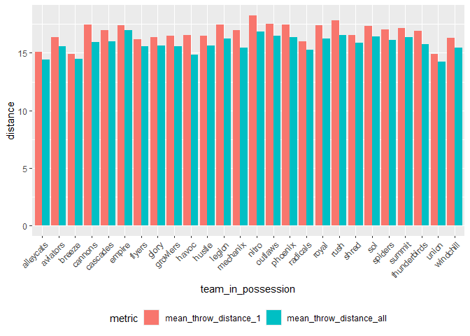
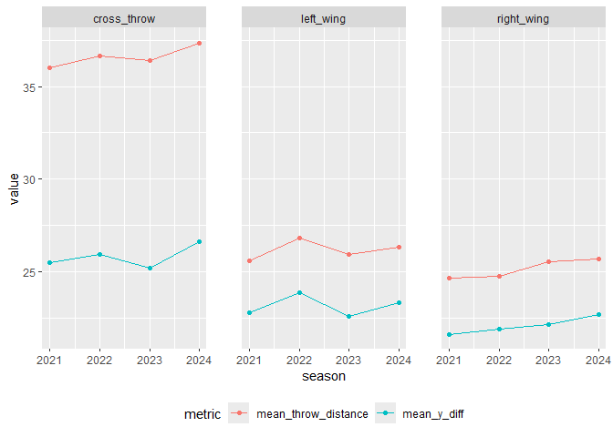
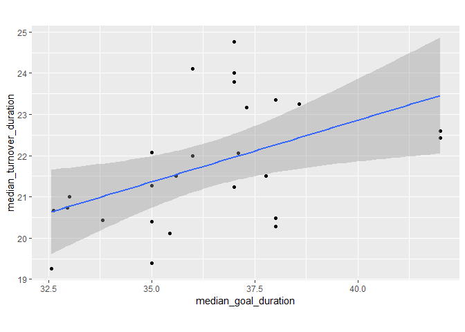
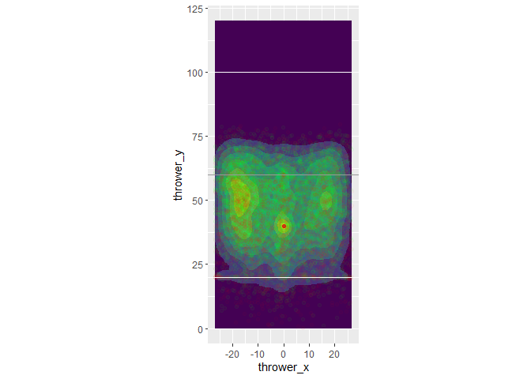
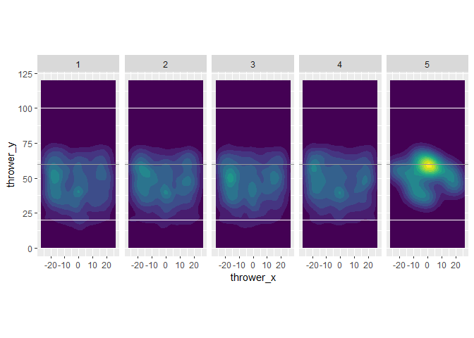

#### 0. Importing and preprocessing the dataset

The code to preprocess the dataset is an improvement from the
implementation in `02_throw_position_data.qmd`.

``` r
rm(list = ls())

library(tidyverse)
```

    ── Attaching core tidyverse packages ──────────────────────── tidyverse 2.0.0 ──
    ✔ dplyr     1.2.1     ✔ readr     2.2.0
    ✔ forcats   1.0.1     ✔ stringr   1.6.0
    ✔ ggplot2   4.0.3     ✔ tibble    3.3.1
    ✔ lubridate 1.9.5     ✔ tidyr     1.3.2
    ✔ purrr     1.2.2     
    ── Conflicts ────────────────────────────────────────── tidyverse_conflicts() ──
    ✖ dplyr::filter() masks stats::filter()
    ✖ dplyr::lag()    masks stats::lag()
    ℹ Use the conflicted package (<http://conflicted.r-lib.org/>) to force all conflicts to become errors

``` r
ufa_throws <- read_csv("https://raw.githubusercontent.com/36-SURE/2026/main/data/ufa_throws.csv")
```

    Rows: 290826 Columns: 24
    ── Column specification ────────────────────────────────────────────────────────
    Delimiter: ","
    chr  (5): thrower, receiver, gameID, home_teamID, away_teamID
    dbl (18): thrower_x, thrower_y, receiver_x, receiver_y, turnover, possession...
    lgl  (1): is_home_team

    ℹ Use `spec()` to retrieve the full column specification for this data.
    ℹ Specify the column types or set `show_col_types = FALSE` to quiet this message.

``` r
ufa_throws
```

    # A tibble: 290,826 × 24
       thrower thrower_x thrower_y receiver receiver_x receiver_y turnover
       <chr>       <dbl>     <dbl> <chr>         <dbl>      <dbl>    <dbl>
     1 jnissen      1.02      15.1 jmalks        -8.17       23.5        0
     2 jmalks      -8.17      23.5 jnissen        2.18       27.1        0
     3 jnissen      2.18      27.1 jmalks       -10.2        33.6        0
     4 jmalks     -10.2       33.6 jnissen       -3.94       26.8        0
     5 jnissen     -3.94      26.8 boort         13.0        36.3        0
     6 boort       13.0       36.3 jmalks         1.74       34.4        0
     7 jmalks       1.74      34.4 jnissen       -9.33       33.1        0
     8 jnissen     -9.33      33.1 khealey       -5.4        45.1        0
     9 khealey     -5.4       45.1 jnissen      -11.8        44.8        0
    10 jnissen    -11.8       44.8 cboxley       -0.08       44.3        0
    # ℹ 290,816 more rows
    # ℹ 17 more variables: possession_num <dbl>, possession_throw <dbl>,
    #   game_quarter <dbl>, is_home_team <lgl>, home_team_score <dbl>,
    #   away_team_score <dbl>, gameID <chr>, home_teamID <chr>, away_teamID <chr>,
    #   times <dbl>, home_team_win <dbl>, score_diff <dbl>, goal <dbl>,
    #   throw_distance <dbl>, x_diff <dbl>, y_diff <dbl>, throw_angle <dbl>

``` r
# Flipping the dataset so that positive x is the right side and negative x is the left side
ufa_throws <- ufa_throws |>
  mutate(thrower_x = (-1) * thrower_x,
         receiver_x = (-1) * receiver_x,
         throw_distance = sqrt((receiver_x-thrower_x)^2 + (receiver_y-thrower_y)^2),
         x_diff = receiver_x - thrower_x,
         throw_angle = atan2(y_diff, x_diff))

ufa_throws
```

    # A tibble: 290,826 × 24
       thrower thrower_x thrower_y receiver receiver_x receiver_y turnover
       <chr>       <dbl>     <dbl> <chr>         <dbl>      <dbl>    <dbl>
     1 jnissen     -1.02      15.1 jmalks         8.17       23.5        0
     2 jmalks       8.17      23.5 jnissen       -2.18       27.1        0
     3 jnissen     -2.18      27.1 jmalks        10.2        33.6        0
     4 jmalks      10.2       33.6 jnissen        3.94       26.8        0
     5 jnissen      3.94      26.8 boort        -13.0        36.3        0
     6 boort      -13.0       36.3 jmalks        -1.74       34.4        0
     7 jmalks      -1.74      34.4 jnissen        9.33       33.1        0
     8 jnissen      9.33      33.1 khealey        5.4        45.1        0
     9 khealey      5.4       45.1 jnissen       11.8        44.8        0
    10 jnissen     11.8       44.8 cboxley        0.08       44.3        0
    # ℹ 290,816 more rows
    # ℹ 17 more variables: possession_num <dbl>, possession_throw <dbl>,
    #   game_quarter <dbl>, is_home_team <lgl>, home_team_score <dbl>,
    #   away_team_score <dbl>, gameID <chr>, home_teamID <chr>, away_teamID <chr>,
    #   times <dbl>, home_team_win <dbl>, score_diff <dbl>, goal <dbl>,
    #   throw_distance <dbl>, x_diff <dbl>, y_diff <dbl>, throw_angle <dbl>

``` r
ufa_throws_updated <- ufa_throws |>
  mutate(attacking_phaseID = consecutive_id(gameID, game_quarter, is_home_team,
                                            possession_num, home_team_score,
                                            away_team_score))
  
ufa_throws_updated
```

    # A tibble: 290,826 × 25
       thrower thrower_x thrower_y receiver receiver_x receiver_y turnover
       <chr>       <dbl>     <dbl> <chr>         <dbl>      <dbl>    <dbl>
     1 jnissen     -1.02      15.1 jmalks         8.17       23.5        0
     2 jmalks       8.17      23.5 jnissen       -2.18       27.1        0
     3 jnissen     -2.18      27.1 jmalks        10.2        33.6        0
     4 jmalks      10.2       33.6 jnissen        3.94       26.8        0
     5 jnissen      3.94      26.8 boort        -13.0        36.3        0
     6 boort      -13.0       36.3 jmalks        -1.74       34.4        0
     7 jmalks      -1.74      34.4 jnissen        9.33       33.1        0
     8 jnissen      9.33      33.1 khealey        5.4        45.1        0
     9 khealey      5.4       45.1 jnissen       11.8        44.8        0
    10 jnissen     11.8       44.8 cboxley        0.08       44.3        0
    # ℹ 290,816 more rows
    # ℹ 18 more variables: possession_num <dbl>, possession_throw <dbl>,
    #   game_quarter <dbl>, is_home_team <lgl>, home_team_score <dbl>,
    #   away_team_score <dbl>, gameID <chr>, home_teamID <chr>, away_teamID <chr>,
    #   times <dbl>, home_team_win <dbl>, score_diff <dbl>, goal <dbl>,
    #   throw_distance <dbl>, x_diff <dbl>, y_diff <dbl>, throw_angle <dbl>,
    #   attacking_phaseID <int>

``` r
# Create attack outcome indicator variables

# 1 = successful (resulting in a goal), 0 = unsuccessful (resulting in a turnover),
# -1 = incompleted (resulting in neither a goal nor a turnover, possibly
# because the quarter is ending)

attack_outcome_indicators <- ufa_throws_updated |>
  select(attacking_phaseID, goal, turnover) |>
  group_by(attacking_phaseID) |>
  summarize(sum_goal = sum(goal),
            sum_turnover = sum(turnover)) |>
  ungroup() |>
  mutate(attack_outcome = case_when(
    sum_goal == 1 ~ 1,
    sum_goal == 0 & sum_turnover >= 1 ~ 0,
    sum_goal == 0 & sum_turnover == 0 ~ -1
  )) |>
  select(attacking_phaseID, attack_outcome)

attack_outcome_indicators
```

    # A tibble: 42,449 × 2
       attacking_phaseID attack_outcome
                   <int>          <dbl>
     1                 1              1
     2                 2              0
     3                 3              1
     4                 4              1
     5                 5              0
     6                 6              0
     7                 7              1
     8                 8              0
     9                 9              0
    10                10              1
    # ℹ 42,439 more rows

``` r
# Join back to the updated UFA throws dataframe
ufa_throws_updated <- ufa_throws_updated |>
  left_join(attack_outcome_indicators)
```

    Joining with `by = join_by(attacking_phaseID)`

``` r
ufa_throws_updated
```

    # A tibble: 290,826 × 26
       thrower thrower_x thrower_y receiver receiver_x receiver_y turnover
       <chr>       <dbl>     <dbl> <chr>         <dbl>      <dbl>    <dbl>
     1 jnissen     -1.02      15.1 jmalks         8.17       23.5        0
     2 jmalks       8.17      23.5 jnissen       -2.18       27.1        0
     3 jnissen     -2.18      27.1 jmalks        10.2        33.6        0
     4 jmalks      10.2       33.6 jnissen        3.94       26.8        0
     5 jnissen      3.94      26.8 boort        -13.0        36.3        0
     6 boort      -13.0       36.3 jmalks        -1.74       34.4        0
     7 jmalks      -1.74      34.4 jnissen        9.33       33.1        0
     8 jnissen      9.33      33.1 khealey        5.4        45.1        0
     9 khealey      5.4       45.1 jnissen       11.8        44.8        0
    10 jnissen     11.8       44.8 cboxley        0.08       44.3        0
    # ℹ 290,816 more rows
    # ℹ 19 more variables: possession_num <dbl>, possession_throw <dbl>,
    #   game_quarter <dbl>, is_home_team <lgl>, home_team_score <dbl>,
    #   away_team_score <dbl>, gameID <chr>, home_teamID <chr>, away_teamID <chr>,
    #   times <dbl>, home_team_win <dbl>, score_diff <dbl>, goal <dbl>,
    #   throw_distance <dbl>, x_diff <dbl>, y_diff <dbl>, throw_angle <dbl>,
    #   attacking_phaseID <int>, attack_outcome <dbl>

``` r
# Add indicator for team in possession, for season, and for direction of attack

ufa_throws_updated <- ufa_throws_updated |>
  mutate(team_in_possession = case_when(
      is_home_team == TRUE ~ home_teamID,
      is_home_team == FALSE ~ away_teamID
      ),
      season = as.numeric(substr(gameID, 1, 4)),
      throw_path_type = case_when(
        (thrower_x >= 0) & (receiver_x >= 0) ~ "right_wing",
        (thrower_x <= 0) & (receiver_x <= 0) ~ "left_wing",
        TRUE ~ "cross_throw"
        ))

ufa_throws_updated
```

    # A tibble: 290,826 × 29
       thrower thrower_x thrower_y receiver receiver_x receiver_y turnover
       <chr>       <dbl>     <dbl> <chr>         <dbl>      <dbl>    <dbl>
     1 jnissen     -1.02      15.1 jmalks         8.17       23.5        0
     2 jmalks       8.17      23.5 jnissen       -2.18       27.1        0
     3 jnissen     -2.18      27.1 jmalks        10.2        33.6        0
     4 jmalks      10.2       33.6 jnissen        3.94       26.8        0
     5 jnissen      3.94      26.8 boort        -13.0        36.3        0
     6 boort      -13.0       36.3 jmalks        -1.74       34.4        0
     7 jmalks      -1.74      34.4 jnissen        9.33       33.1        0
     8 jnissen      9.33      33.1 khealey        5.4        45.1        0
     9 khealey      5.4       45.1 jnissen       11.8        44.8        0
    10 jnissen     11.8       44.8 cboxley        0.08       44.3        0
    # ℹ 290,816 more rows
    # ℹ 22 more variables: possession_num <dbl>, possession_throw <dbl>,
    #   game_quarter <dbl>, is_home_team <lgl>, home_team_score <dbl>,
    #   away_team_score <dbl>, gameID <chr>, home_teamID <chr>, away_teamID <chr>,
    #   times <dbl>, home_team_win <dbl>, score_diff <dbl>, goal <dbl>,
    #   throw_distance <dbl>, x_diff <dbl>, y_diff <dbl>, throw_angle <dbl>,
    #   attacking_phaseID <int>, attack_outcome <dbl>, team_in_possession <chr>, …

#### 1. Mean throwing distance of each team in the dataset

We want to know the mean throwing distance of each team, faceted/
classified by all attacking phases vs. successful attacking phases only.

``` r
# Mean throwing distance (successful attacking phases)
throw_dist_by_team_1 <- ufa_throws_updated |>
  filter(attack_outcome == 1,
         !(team_in_possession %in% c("allstars1", "allstars2"))) |>
  select(team_in_possession, throw_distance) |>
  group_by(team_in_possession) |>
  summarize(mean_throw_distance_1 = mean(throw_distance)) |>
  arrange(desc(mean_throw_distance_1))

throw_dist_by_team_1
```

    # A tibble: 26 × 2
       team_in_possession mean_throw_distance_1
       <chr>                              <dbl>
     1 nitro                               18.3
     2 rush                                17.8
     3 outlaws                             17.5
     4 phoenix                             17.5
     5 cannons                             17.5
     6 legion                              17.4
     7 royal                               17.4
     8 empire                              17.4
     9 sol                                 17.4
    10 summit                              17.1
    # ℹ 16 more rows

``` r
# Mean throwing distance (all attacking phases, except for turnovers)
throw_dist_by_team_all <- ufa_throws_updated |>
  filter(turnover != 1,
         !(team_in_possession %in% c("allstars1", "allstars2"))) |>
  select(team_in_possession, throw_distance) |>
  group_by(team_in_possession) |>
  summarize(mean_throw_distance_all = mean(throw_distance)) |>
  arrange(desc(mean_throw_distance_all))

throw_dist_by_team_all
```

    # A tibble: 26 × 2
       team_in_possession mean_throw_distance_all
       <chr>                                <dbl>
     1 empire                                16.9
     2 nitro                                 16.8
     3 rush                                  16.6
     4 outlaws                               16.5
     5 sol                                   16.4
     6 summit                                16.4
     7 phoenix                               16.4
     8 royal                                 16.3
     9 legion                                16.2
    10 spiders                               16.1
    # ℹ 16 more rows

``` r
# Join both dataframes together and plot
throw_dist_by_team_1 |>
  inner_join(throw_dist_by_team_all) |>
  pivot_longer(-team_in_possession, names_to = "metric", values_to = "distance") |>
  ggplot(aes(x = team_in_possession, y = distance, fill = metric)) +
  geom_col(position = "dodge") +
  theme(legend.position = "bottom",
        axis.text.x = element_text(angle = 45,
                                   vjust = 1, hjust = 1))
```

    Joining with `by = join_by(team_in_possession)`



#### 2. Do players typically throw longer distances in a left-wing, right-wing, or cross-throws?

``` r
# For all throws that do not result in a turnover
ufa_throws_updated |>
  filter(turnover != 0) |>
  select(throw_path_type, throw_distance) |>
  group_by(throw_path_type) |>
  summarize(mean_throw_distance = mean(throw_distance))
```

    # A tibble: 3 × 2
      throw_path_type mean_throw_distance
      <chr>                         <dbl>
    1 cross_throw                    36.6
    2 left_wing                      26.2
    3 right_wing                     25.2

``` r
# Is the impact caused by the y-difference?
ufa_throws_updated |>
  filter(turnover != 0) |>
  select(throw_path_type, y_diff) |>
  group_by(throw_path_type) |>
  summarize(mean_y_diff = mean(y_diff))
```

    # A tibble: 3 × 2
      throw_path_type mean_y_diff
      <chr>                 <dbl>
    1 cross_throw            25.8
    2 left_wing              23.2
    3 right_wing             22.1

It seems that teams possibly performs cross throws to launch attacks
higher up the field, leading to both higher mean distance and higher
y-difference. The following graph confirms the intuition.

``` r
# Are they different by season?
# https://stackoverflow.com/questions/3681647/ggplot-how-to-increase-spacing-between-faceted-plots

library(grid)

ufa_throws_updated |>
  filter(turnover != 0) |>
  select(throw_path_type, season, throw_distance, y_diff) |>
  group_by(throw_path_type, season) |>
  summarize(mean_throw_distance = mean(throw_distance),
            mean_y_diff = mean(y_diff)) |>
  ungroup() |>
  pivot_longer(c(mean_throw_distance, mean_y_diff),
               names_to = "metric", values_to = "value") |>
  ggplot(aes(x = season, y = value, color = metric)) +
  geom_point() + geom_line() + facet_wrap(~ throw_path_type) +
  theme(legend.position = "bottom",
        panel.spacing = unit(2, "lines"))
```

    `summarise()` has regrouped the output.
    ℹ Summaries were computed grouped by throw_path_type and season.
    ℹ Output is grouped by throw_path_type.
    ℹ Use `summarise(.groups = "drop_last")` to silence this message.
    ℹ Use `summarise(.by = c(throw_path_type, season))` for per-operation grouping
      (`?dplyr::dplyr_by`) instead.



#### 3. What is the typical time taken for a team’s attacking phase?

We will explore this in two ways:

- Only counting the successful attacking phases (time taken to get a
  goal).
- Only counting the unsuccessful attacking phases (time taken to get a
  turnover).

``` r
# Output median duration for a successful attacking phase for each team
time_for_goals <- ufa_throws_updated |>
  filter(attack_outcome == 1 &
           !(team_in_possession %in% c("allstars1", "allstars2"))) |>
  select(attacking_phaseID, team_in_possession, times) |>
  group_by(attacking_phaseID, team_in_possession) |>
  summarize(attacking_phase_duration = max(times) - min(times)) |>
  ungroup() |>
  select(-attacking_phaseID) |>
  group_by(team_in_possession) |>
  summarize(median_goal_duration = median(attacking_phase_duration))
```

    `summarise()` has regrouped the output.
    ℹ Summaries were computed grouped by attacking_phaseID and team_in_possession.
    ℹ Output is grouped by attacking_phaseID.
    ℹ Use `summarise(.groups = "drop_last")` to silence this message.
    ℹ Use `summarise(.by = c(attacking_phaseID, team_in_possession))` for
      per-operation grouping (`?dplyr::dplyr_by`) instead.

``` r
time_for_goals
```

    # A tibble: 26 × 2
       team_in_possession median_goal_duration
       <chr>                             <dbl>
     1 alleycats                          38  
     2 aviators                           38.6
     3 breeze                             42  
     4 cannons                            36  
     5 cascades                           35.4
     6 empire                             42  
     7 flyers                             38  
     8 glory                              37.8
     9 growlers                           35  
    10 havoc                              33.0
    # ℹ 16 more rows

``` r
# We do the similar operation with unsuccessful attacking phases for each team
time_for_turnovers <- ufa_throws_updated |>
  filter(attack_outcome == 0 &
           !(team_in_possession %in% c("allstars1", "allstars2"))) |>
  select(attacking_phaseID, team_in_possession, times) |>
  group_by(attacking_phaseID, team_in_possession) |>
  summarize(attacking_phase_duration = max(times) - min(times)) |>
  ungroup() |>
  select(-attacking_phaseID) |>
  group_by(team_in_possession) |>
  summarize(median_turnover_duration = median(attacking_phase_duration))
```

    `summarise()` has regrouped the output.
    ℹ Summaries were computed grouped by attacking_phaseID and team_in_possession.
    ℹ Output is grouped by attacking_phaseID.
    ℹ Use `summarise(.groups = "drop_last")` to silence this message.
    ℹ Use `summarise(.by = c(attacking_phaseID, team_in_possession))` for
      per-operation grouping (`?dplyr::dplyr_by`) instead.

``` r
time_for_turnovers
```

    # A tibble: 26 × 2
       team_in_possession median_turnover_duration
       <chr>                                 <dbl>
     1 alleycats                              23.3
     2 aviators                               23.2
     3 breeze                                 22.6
     4 cannons                                22  
     5 cascades                               20.1
     6 empire                                 22.4
     7 flyers                                 20.5
     8 glory                                  21.5
     9 growlers                               22.1
    10 havoc                                  20.7
    # ℹ 16 more rows

``` r
# Join both tibbles together and plot
# https://stackoverflow.com/questions/67181008/how-to-draw-a-45-degree-line-through-a-point-in-ggplot2
time_for_goals |>
  left_join(time_for_turnovers, join_by(team_in_possession)) |>
  ggplot(aes(x = median_goal_duration, y = median_turnover_duration)) +
  geom_point() + geom_smooth(method = "lm") + coord_fixed()
```

    `geom_smooth()` using formula = 'y ~ x'



#### 4. When, where, and how long are the “huck” passes?

In ultimate frisbee, a “huck” means a very long throw of at least 40
yards (as defined by the UFA and previously the AUDL), making very far
up the field. The “40-yards” are measured by `y_diff` instead of
`throw_distance` values.

Exact definitions of how long should the “huck” be vary a lot by
tournament; I just found that information unofficially on a Reddit post:

https://www.reddit.com/r/ultimate/comments/v6qlv0/the_audl_has_started_taking_stats_on_hucks_in/

``` r
huck_throws <- ufa_throws_updated |>
  filter(y_diff >= 40)

huck_throws
```

    # A tibble: 12,967 × 29
       thrower   thrower_x thrower_y receiver  receiver_x receiver_y turnover
       <chr>         <dbl>     <dbl> <chr>          <dbl>      <dbl>    <dbl>
     1 tchan         -2.41      65.8 pboerth        17.1       107.         0
     2 ndick         24.3       46   rlinehan       17.8       102.         0
     3 csunde        15.4       44.2 tchan          10.2       111.         0
     4 tchan          3.71      35.4 pboerth        -9.96      105.         0
     5 cdavisbra     13.6       16.4 <NA>            5.2        91.0        1
     6 thalkyard      9.84      54.9 lharwood       19.9       103.         0
     7 ilee           0         40   lrehfuss      -11.2        93.8        0
     8 cmcsweene     23.8       19.6 thalkyard      11.5        63.2        0
     9 tchan          3.78      39.7 <NA>            5.2       104.         1
    10 rbergeron     16.9       41.6 <NA>           12.3        91.7        1
    # ℹ 12,957 more rows
    # ℹ 22 more variables: possession_num <dbl>, possession_throw <dbl>,
    #   game_quarter <dbl>, is_home_team <lgl>, home_team_score <dbl>,
    #   away_team_score <dbl>, gameID <chr>, home_teamID <chr>, away_teamID <chr>,
    #   times <dbl>, home_team_win <dbl>, score_diff <dbl>, goal <dbl>,
    #   throw_distance <dbl>, x_diff <dbl>, y_diff <dbl>, throw_angle <dbl>,
    #   attacking_phaseID <int>, attack_outcome <dbl>, team_in_possession <chr>, …

``` r
# Plot the position of hucks on a heat map
huck_throws |>
  ggplot(aes(x = thrower_x, y = thrower_y)) +
  geom_density_2d_filled() +
  geom_point(data = huck_throws |> filter(attack_outcome == 1),
             color = "green", alpha = 0.035) +
  geom_point(data = huck_throws |> filter(attack_outcome != 1),
             color = "red", alpha = 0.025) +
  scale_x_continuous(limits = c(-(26+2/3), 26+2/3)) +
  scale_y_continuous(limits = c(0, 120)) +
  geom_hline(yintercept = 20, color = "white") +
  geom_hline(yintercept = 100, color = "white") +
  # New addition: The midpoint line
  geom_hline(yintercept = 60, color = "gray60") +
  coord_fixed() + theme(legend.position = "none")
```

    Warning: Removed 27 rows containing non-finite outside the scale range
    (`stat_density2d_filled()`).

    Warning: Removed 15 rows containing missing values or values outside the scale range
    (`geom_point()`).

    Warning: Removed 12 rows containing missing values or values outside the scale range
    (`geom_point()`).



It turns out that most long throws (“hucks”) are actually performed in
the left wing!

The clear red point is likely to be the “brick” (location `(0,40)`), a
location from which a player can opt to throw when the opponent’s disc
goes out of bounds.

Bonus: Do the successfully completed hucks results in goals afterwards?

``` r
huck_throws |>
  count(attack_outcome)
```

    # A tibble: 3 × 2
      attack_outcome     n
               <dbl> <int>
    1             -1   109
    2              0  5562
    3              1  7296

Bonus: How does the huck throw’s location change as the match
progresses?

``` r
# Similar heat map as before, just faceted by quarter

huck_throws |>
  ggplot(aes(x = thrower_x, y = thrower_y)) +
  geom_density_2d_filled() +
  # If we keep plotting additional geom_point, the "brick point" was the most
  # prominent in Q1 (as a red point), but became less and less visible from Q2-5.
  
  #geom_point(data = huck_throws |> filter(attack_outcome == 1),
             #color = "green", alpha = 0.035) +
  #geom_point(data = huck_throws |> filter(attack_outcome != 1),
             #color = "red", alpha = 0.025) +
  
  scale_x_continuous(limits = c(-(26+2/3), 26+2/3)) +
  scale_y_continuous(limits = c(0, 120)) +
  geom_hline(yintercept = 20, color = "white") +
  geom_hline(yintercept = 100, color = "white") +
  geom_hline(yintercept = 60, color = "gray60") +
  coord_fixed() + theme(legend.position = "none") +
  facet_wrap(~ game_quarter, nrow = 1, ncol = 5)
```

    Warning: Removed 27 rows containing non-finite outside the scale range
    (`stat_density2d_filled()`).



In overtime, huck throws are much more common from the center of the
field (at least in terms of proportion) than in regulation time.

#### 5. What about the “hockey assist” passes?

In ultimate frisbee, “assist” means a pass directly to the end zone,
which scores a goal. (I will call them “goals” so that the audience is
less confused.)

A pass that directly precedes an assist is called the “hockey assist”,
which is actually what we know about assists in other sports.

\[TO BE UPDATED\]

#### 6. Do something about the conversion rate (Ratio of goals over the number of possession, or attacking phases, that the team has made)

\[TO BE UPDATED\]

#### Some randomly discovered useful frisbee analytics articles that might become an inspiration:

- https://www.watchufa.com/league/news/2024-important-stats-analyze-throwers
- https://ultiworld.com/2013/08/26/goals-assists-cares-take-team-approach-statistics/
- Already from CMU:
  https://www.stat.cmu.edu/capstoneresearch/spring2024/460files/team16.html

Glossary for Ultimate Frisbee analytics terms:

- https://ultiworld.com/feature/ultimate-frisbee-glossary/
- https://watchufa.com/stats/glossary

The dataset for this EDA project has also been promoted by UFA itself:

- https://www.watchufa.com/league/news/2026-ufa-shown-space-stats-analytics-introduction
- https://shownspace.com/
- https://shownspace.substack.com/
