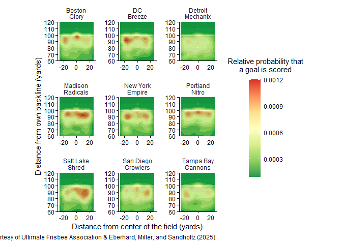
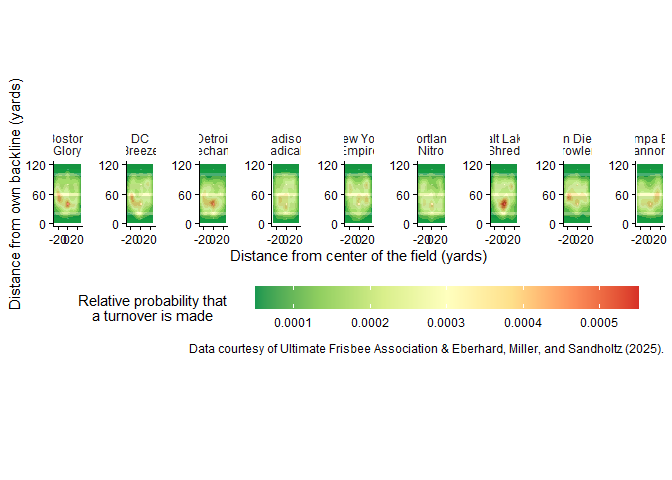
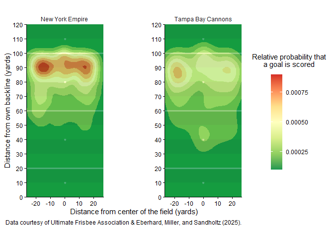

``` r
rm(list = ls())
library(tidyverse)
```

    ── Attaching core tidyverse packages ──────────────────────── tidyverse 2.0.0 ──
    ✔ dplyr     1.2.1     ✔ readr     2.2.0
    ✔ forcats   1.0.1     ✔ stringr   1.6.0
    ✔ ggplot2   4.0.3     ✔ tibble    3.3.1
    ✔ lubridate 1.9.5     ✔ tidyr     1.3.2
    ✔ purrr     1.2.2     
    ── Conflicts ────────────────────────────────────────── tidyverse_conflicts() ──
    ✖ dplyr::filter() masks stats::filter()
    ✖ dplyr::lag()    masks stats::lag()
    ℹ Use the conflicted package (<http://conflicted.r-lib.org/>) to force all conflicts to become errors

#### How did I choose the teams in the case study?

``` r
full_team_stats <- read.csv("full_team_stats.csv", sep = ",")
full_team_stats
```

               team total_games total_wins total_losses win_pct total_throws
    1     alleycats          50         23           27   0.460        12921
    2      aviators          46         19           27   0.413        10193
    3        breeze          50         40           10   0.800        12772
    4       cannons          24          3           21   0.125         4813
    5      cascades          49         20           29   0.408        10620
    6        empire          53         45            8   0.849        12035
    7        flyers          53         41           12   0.774        12307
    8         glory          50         25           25   0.500        10468
    9      growlers          50         27           23   0.540         9974
    10        havoc          23          8           15   0.348         4630
    11       hustle          46         32           14   0.696         9278
    12       legion          45          9           36   0.200         9659
    13     mechanix          48          1           47   0.021        10840
    14        nitro          35          4           31   0.114         7550
    15      outlaws          18          4           14   0.222         3269
    16      phoenix          46         19           27   0.413        10459
    17     radicals          49         27           22   0.551        10162
    18        royal          43         14           29   0.326         7417
    19         rush          44         12           32   0.273         8614
    20        shred          40         32            8   0.800         9294
    21          sol          49         29           20   0.592        10780
    22      spiders          44         20           24   0.455         9560
    23       summit          38         25           13   0.658         9091
    24 thunderbirds          45         15           30   0.333         8269
    25        union          53         36           17   0.679        12107
    26    windchill          55         43           12   0.782        12063
       throws_per_goal total_turnovers total_goals_scored total_goals_conceded
    1             13.1             765                984                  991
    2             12.6             830                809                  881
    3             12.2             671               1045                  835
    4             13.1             565                368                  539
    5             11.0             967                967                  989
    6             10.7             675               1121                  855
    7             10.9             783               1134                  940
    8             11.2             768                931                  912
    9             10.8             865                925                  922
    10            13.5             518                344                  443
    11            10.1             607                917                  749
    12            12.2             984                792                  976
    13            14.5            1166                746                 1173
    14            12.6             813                599                  838
    15            10.2             328                322                  373
    16            12.7             790                823                  879
    17            11.2             789                907                  835
    18            12.0             719                618                  736
    19            11.6             753                743                  882
    20            10.3             646                899                  760
    21            10.4             894               1035                  931
    22            10.6             833                900                  892
    23            11.2             591                815                  687
    24            11.9             682                697                  754
    25            11.7             847               1039                  899
    26            10.8             940               1114                  923
       plus_minus goal_ratio turnover_ratio home_games home_wins home_losses
    1          -7      0.067          0.052         24        13          11
    2         -72      0.068          0.070         23        11          12
    3         210      0.072          0.046         26        21           5
    4        -171      0.064          0.098         12         2          10
    5         -22      0.077          0.077         26        13          13
    6         266      0.081          0.049         30        27           3
    7         194      0.080          0.055         26        23           3
    8          19      0.077          0.063         24        14          10
    9           3      0.079          0.074         25        16           9
    10        -99      0.063          0.094         12         5           7
    11        168      0.085          0.056         22        18           4
    12       -184      0.069          0.086         22         5          17
    13       -427      0.059          0.091         24         1          23
    14       -239      0.067          0.091         17         3          14
    15        -51      0.082          0.084          9         2           7
    16        -56      0.068          0.065         22        10          12
    17         72      0.076          0.067         25        14          11
    18       -118      0.071          0.082         23         7          16
    19       -139      0.073          0.074         21         7          14
    20        139      0.083          0.060         21        17           4
    21        104      0.081          0.070         23        16           7
    22          8      0.080          0.074         19        11           8
    23        128      0.078          0.056         21        15           6
    24        -57      0.072          0.071         22         8          14
    25        140      0.074          0.061         26        18           8
    26        191      0.079          0.067         28        22           6
       home_throws home_turnovers away_games away_wins away_losses away_throws
    1         6415            298         26        10          16        6506
    2         5218            434         23         8          15        4975
    3         6542            335         24        19           5        6230
    4         2353            259         12         1          11        2460
    5         5644            493         23         7          16        4976
    6         6747            357         23        18           5        5288
    7         5773            369         27        18           9        6534
    8         5030            369         26        11          15        5438
    9         4903            387         25        11          14        5071
    10        2267            284         11         3           8        2363
    11        4376            244         24        14          10        4902
    12        4601            483         23         4          19        5058
    13        5049            607         24         0          24        5791
    14        3736            351         18         1          17        3814
    15        1446            160          9         2           7        1823
    16        4906            344         24         9          15        5553
    17        5192            375         24        13          11        4970
    18        4082            408         20         7          13        3335
    19        3925            323         23         5          18        4689
    20        4725            324         19        15           4        4569
    21        5004            392         26        13          13        5776
    22        4177            410         25         9          16        5383
    23        4771            315         17        10           7        4320
    24        5171            400         23         7          16        3098
    25        5877            401         27        18           9        6230
    26        5692            503         27        21           6        6371
       away_turnovers avg_throw_distance avg_goal_distance avg_turnover_distance
    1             467              15.01             31.00                 26.17
    2             396              16.44             27.72                 27.83
    3             336              15.26             26.89                 30.75
    4             306              16.87             33.46                 25.55
    5             474              16.92             31.88                 28.03
    6             318              17.70             30.51                 32.41
    7             414              16.46             28.60                 31.39
    8             399              16.51             29.47                 29.31
    9             478              16.22             29.27                 23.97
    10            234              15.95             31.46                 26.42
    11            363              16.33             32.43                 27.63
    12            501              17.30             33.00                 28.55
    13            559              16.19             34.34                 23.63
    14            462              18.24             30.94                 32.16
    15            168              17.07             32.40                 23.36
    16            446              17.36             34.10                 31.58
    17            414              16.21             28.96                 29.66
    18            311              16.98             30.97                 24.95
    19            430              17.20             32.49                 25.10
    20            322              16.61             30.96                 28.61
    21            502              17.47             29.37                 31.41
    22            423              16.92             30.78                 26.99
    23            276              17.31             31.19                 33.01
    24            282              16.88             33.39                 31.64
    25            446              15.04             26.21                 27.23
    26            437              16.52             29.43                 31.78
       avg_throw_angle long_throw_rate long_goal_rate short_goal_rate
    1            1.530           0.052          0.356           0.068
    2            1.566           0.061          0.289           0.102
    3            1.549           0.049          0.255           0.073
    4            1.527           0.084          0.412           0.047
    5            1.526           0.073          0.356           0.047
    6            1.556           0.064          0.346           0.038
    7            1.541           0.070          0.308           0.145
    8            1.548           0.062          0.318           0.099
    9            1.557           0.064          0.308           0.048
    10           1.520           0.067          0.338           0.073
    11           1.555           0.066          0.386           0.040
    12           1.536           0.084          0.414           0.079
    13           1.525           0.064          0.435           0.036
    14           1.552           0.084          0.351           0.109
    15           1.557           0.072          0.370           0.073
    16           1.542           0.076          0.449           0.079
    17           1.555           0.059          0.317           0.081
    18           1.523           0.068          0.333           0.045
    19           1.553           0.066          0.403           0.065
    20           1.582           0.059          0.315           0.046
    21           1.551           0.078          0.322           0.100
    22           1.542           0.077          0.362           0.093
    23           1.551           0.071          0.342           0.077
    24           1.547           0.068          0.408           0.077
    25           1.562           0.053          0.248           0.120
    26           1.535           0.067          0.314           0.076
       medium_goal_rate short_throw_rate medium_throw_rate long_throw_turnover_rate
    1             0.576            0.325             0.623                    0.302
    2             0.609            0.229             0.710                    0.391
    3             0.672            0.277             0.673                    0.356
    4             0.541            0.263             0.653                    0.398
    5             0.597            0.242             0.685                    0.375
    6             0.616            0.134             0.802                    0.306
    7             0.547            0.273             0.657                    0.311
    8             0.584            0.248             0.690                    0.357
    9             0.645            0.234             0.702                    0.342
    10            0.588            0.294             0.639                    0.447
    11            0.574            0.247             0.688                    0.274
    12            0.507            0.253             0.664                    0.384
    13            0.529            0.251             0.685                    0.385
    14            0.540            0.182             0.733                    0.416
    15            0.557            0.205             0.723                    0.356
    16            0.472            0.230             0.694                    0.325
    17            0.602            0.238             0.702                    0.391
    18            0.622            0.200             0.731                    0.352
    19            0.532            0.198             0.736                    0.302
    20            0.639            0.245             0.696                    0.311
    21            0.578            0.230             0.693                    0.340
    22            0.544            0.268             0.654                    0.330
    23            0.581            0.240             0.689                    0.310
    24            0.515            0.260             0.671                    0.368
    25            0.633            0.309             0.638                    0.363
    26            0.610            0.260             0.672                    0.388
       medium_throw_turnover_rate short_throw_turnover_rate goals_q1 goals_q2
    1                       0.040                     0.035      256      242
    2                       0.046                     0.061      216      198
    3                       0.033                     0.023      272      241
    4                       0.051                     0.120      100       83
    5                       0.047                     0.072      234      233
    6                       0.031                     0.033      296      268
    7                       0.035                     0.037      282      282
    8                       0.044                     0.043      250      230
    9                       0.045                     0.084      254      248
    10                      0.066                     0.078       85       84
    11                      0.044                     0.033      236      232
    12                      0.054                     0.073      185      190
    13                      0.059                     0.106      182      184
    14                      0.062                     0.057      163      136
    15                      0.042                     0.136       88       74
    16                      0.048                     0.031      218      202
    17                      0.049                     0.038      226      241
    18                      0.049                     0.110      189      150
    19                      0.051                     0.084      203      187
    20                      0.044                     0.043      225      237
    21                      0.052                     0.035      249      275
    22                      0.045                     0.070      224      222
    23                      0.041                     0.026      200      200
    24                      0.054                     0.036      172      162
    25                      0.049                     0.033      278      249
    26                      0.051                     0.023      285      289
       goals_q3 goals_q4 goals_q5 turnovers_q1 turnovers_q2 turnovers_q3
    1       232      225        0          204          208          189
    2       193      192        1          237          227          199
    3       258      265        5          173          178          166
    4        93       88        0          160          142          140
    5       244      247        2          270          239          250
    6       285      258        3          170          175          174
    7       276      290        0          210          198          204
    8       227      214        1          210          210          170
    9       213      201        4          239          213          218
    10       85       74        0          156          139          109
    11      230      210        7          157          149          143
    12      205      206        1          273          260          228
    13      179      183        0          315          298          284
    14      147      152        0          202          207          214
    15       86       68        0           91           80           80
    16      198      195        0          215          210          189
    17      224      195        1          224          212          189
    18      133      128        0          195          166          195
    19      176      174        0          206          201          190
    20      221      203        2          174          157          170
    21      260      246        0          251          236          203
    22      213      229        1          219          214          211
    23      218      192        0          172          158          124
    24      182      146        0          235          164          147
    25      260      250        0          230          231          199
    26      265      265        3          258          250          221
       turnovers_q4 turnover_q5 power_quarter turnovers_quarter
    1           164           0            Q1                Q2
    2           166           1            Q1                Q1
    3           154           0            Q1                Q2
    4           123           0            Q1                Q1
    5           204           4            Q4                Q1
    6           155           1            Q1                Q2
    7           171           0            Q4                Q1
    8           177           1            Q1                Q1
    9           192           3            Q1                Q1
    10          114           0            Q1                Q1
    11          155           3            Q1                Q1
    12          219           4            Q4                Q1
    13          269           0            Q2                Q1
    14          190           0            Q1                Q3
    15           77           0            Q1                Q1
    16          175           1            Q1                Q1
    17          161           3            Q2                Q1
    18          163           0            Q1                Q1
    19          156           0            Q1                Q1
    20          145           0            Q2                Q1
    21          204           0            Q2                Q1
    22          186           3            Q4                Q1
    23          137           0            Q3                Q1
    24          136           0            Q3                Q1
    25          187           0            Q1                Q2
    26          209           2            Q2                Q1

``` r
# Elite teams (top 3): empire, shred, breeze. win_pct >= 0.8
# Mediocre teams (middle 3): radicals, growlers, glory. win_pct >= 0.5
# Underperforming teams (bottom 3): cannons, nitro, mechanix. win_pct lowest

selected_teams = c("empire", "shred", "breeze",
                   "radicals", "growlers", "glory",
                   "cannons", "nitro", "mechanix")

selected_team_stats <- full_team_stats |>
  filter(team %in% selected_teams) |>
  arrange(desc(win_pct))

selected_team_stats
```

          team total_games total_wins total_losses win_pct total_throws
    1   empire          53         45            8   0.849        12035
    2   breeze          50         40           10   0.800        12772
    3    shred          40         32            8   0.800         9294
    4 radicals          49         27           22   0.551        10162
    5 growlers          50         27           23   0.540         9974
    6    glory          50         25           25   0.500        10468
    7  cannons          24          3           21   0.125         4813
    8    nitro          35          4           31   0.114         7550
    9 mechanix          48          1           47   0.021        10840
      throws_per_goal total_turnovers total_goals_scored total_goals_conceded
    1            10.7             675               1121                  855
    2            12.2             671               1045                  835
    3            10.3             646                899                  760
    4            11.2             789                907                  835
    5            10.8             865                925                  922
    6            11.2             768                931                  912
    7            13.1             565                368                  539
    8            12.6             813                599                  838
    9            14.5            1166                746                 1173
      plus_minus goal_ratio turnover_ratio home_games home_wins home_losses
    1        266      0.081          0.049         30        27           3
    2        210      0.072          0.046         26        21           5
    3        139      0.083          0.060         21        17           4
    4         72      0.076          0.067         25        14          11
    5          3      0.079          0.074         25        16           9
    6         19      0.077          0.063         24        14          10
    7       -171      0.064          0.098         12         2          10
    8       -239      0.067          0.091         17         3          14
    9       -427      0.059          0.091         24         1          23
      home_throws home_turnovers away_games away_wins away_losses away_throws
    1        6747            357         23        18           5        5288
    2        6542            335         24        19           5        6230
    3        4725            324         19        15           4        4569
    4        5192            375         24        13          11        4970
    5        4903            387         25        11          14        5071
    6        5030            369         26        11          15        5438
    7        2353            259         12         1          11        2460
    8        3736            351         18         1          17        3814
    9        5049            607         24         0          24        5791
      away_turnovers avg_throw_distance avg_goal_distance avg_turnover_distance
    1            318              17.70             30.51                 32.41
    2            336              15.26             26.89                 30.75
    3            322              16.61             30.96                 28.61
    4            414              16.21             28.96                 29.66
    5            478              16.22             29.27                 23.97
    6            399              16.51             29.47                 29.31
    7            306              16.87             33.46                 25.55
    8            462              18.24             30.94                 32.16
    9            559              16.19             34.34                 23.63
      avg_throw_angle long_throw_rate long_goal_rate short_goal_rate
    1           1.556           0.064          0.346           0.038
    2           1.549           0.049          0.255           0.073
    3           1.582           0.059          0.315           0.046
    4           1.555           0.059          0.317           0.081
    5           1.557           0.064          0.308           0.048
    6           1.548           0.062          0.318           0.099
    7           1.527           0.084          0.412           0.047
    8           1.552           0.084          0.351           0.109
    9           1.525           0.064          0.435           0.036
      medium_goal_rate short_throw_rate medium_throw_rate long_throw_turnover_rate
    1            0.616            0.134             0.802                    0.306
    2            0.672            0.277             0.673                    0.356
    3            0.639            0.245             0.696                    0.311
    4            0.602            0.238             0.702                    0.391
    5            0.645            0.234             0.702                    0.342
    6            0.584            0.248             0.690                    0.357
    7            0.541            0.263             0.653                    0.398
    8            0.540            0.182             0.733                    0.416
    9            0.529            0.251             0.685                    0.385
      medium_throw_turnover_rate short_throw_turnover_rate goals_q1 goals_q2
    1                      0.031                     0.033      296      268
    2                      0.033                     0.023      272      241
    3                      0.044                     0.043      225      237
    4                      0.049                     0.038      226      241
    5                      0.045                     0.084      254      248
    6                      0.044                     0.043      250      230
    7                      0.051                     0.120      100       83
    8                      0.062                     0.057      163      136
    9                      0.059                     0.106      182      184
      goals_q3 goals_q4 goals_q5 turnovers_q1 turnovers_q2 turnovers_q3
    1      285      258        3          170          175          174
    2      258      265        5          173          178          166
    3      221      203        2          174          157          170
    4      224      195        1          224          212          189
    5      213      201        4          239          213          218
    6      227      214        1          210          210          170
    7       93       88        0          160          142          140
    8      147      152        0          202          207          214
    9      179      183        0          315          298          284
      turnovers_q4 turnover_q5 power_quarter turnovers_quarter
    1          155           1            Q1                Q2
    2          154           0            Q1                Q2
    3          145           0            Q2                Q1
    4          161           3            Q2                Q1
    5          192           3            Q1                Q1
    6          177           1            Q1                Q1
    7          123           0            Q1                Q1
    8          190           0            Q1                Q3
    9          269           0            Q2                Q1

``` r
ufa_throws <- read_csv("https://raw.githubusercontent.com/36-SURE/2026/main/data/ufa_throws.csv")
```

    Rows: 290826 Columns: 24
    ── Column specification ────────────────────────────────────────────────────────
    Delimiter: ","
    chr  (5): thrower, receiver, gameID, home_teamID, away_teamID
    dbl (18): thrower_x, thrower_y, receiver_x, receiver_y, turnover, possession...
    lgl  (1): is_home_team

    ℹ Use `spec()` to retrieve the full column specification for this data.
    ℹ Specify the column types or set `show_col_types = FALSE` to quiet this message.

``` r
ufa_throws
```

    # A tibble: 290,826 × 24
       thrower thrower_x thrower_y receiver receiver_x receiver_y turnover
       <chr>       <dbl>     <dbl> <chr>         <dbl>      <dbl>    <dbl>
     1 jnissen      1.02      15.1 jmalks        -8.17       23.5        0
     2 jmalks      -8.17      23.5 jnissen        2.18       27.1        0
     3 jnissen      2.18      27.1 jmalks       -10.2        33.6        0
     4 jmalks     -10.2       33.6 jnissen       -3.94       26.8        0
     5 jnissen     -3.94      26.8 boort         13.0        36.3        0
     6 boort       13.0       36.3 jmalks         1.74       34.4        0
     7 jmalks       1.74      34.4 jnissen       -9.33       33.1        0
     8 jnissen     -9.33      33.1 khealey       -5.4        45.1        0
     9 khealey     -5.4       45.1 jnissen      -11.8        44.8        0
    10 jnissen    -11.8       44.8 cboxley       -0.08       44.3        0
    # ℹ 290,816 more rows
    # ℹ 17 more variables: possession_num <dbl>, possession_throw <dbl>,
    #   game_quarter <dbl>, is_home_team <lgl>, home_team_score <dbl>,
    #   away_team_score <dbl>, gameID <chr>, home_teamID <chr>, away_teamID <chr>,
    #   times <dbl>, home_team_win <dbl>, score_diff <dbl>, goal <dbl>,
    #   throw_distance <dbl>, x_diff <dbl>, y_diff <dbl>, throw_angle <dbl>

``` r
ufa_throws_updated <- ufa_throws |>
  # Flipping the dataset so that positive x is the right side and negative x
  # is the left side
  mutate(thrower_x = (-1) * thrower_x,
         receiver_x = (-1) * receiver_x,
         throw_distance = sqrt((receiver_x-thrower_x)^2 + (receiver_y-thrower_y)^2),
         x_diff = receiver_x - thrower_x,
         throw_angle = atan2(y_diff, x_diff),
  # Add the teams in possession data
         team_in_possession = ifelse(is_home_team == TRUE,
                                     home_teamID, away_teamID),
  # Add the throw path type data for individual throws & attack outcome
         throw_path_type = case_when(
           (thrower_x >= 0) & (receiver_x >= 0) ~ "right_wing",
           (thrower_x <= 0) & (receiver_x <= 0) ~ "left_wing",
           TRUE ~ "cross_throws"
           ),
  attacking_phaseID = consecutive_id(gameID, game_quarter, is_home_team,
                                     possession_num, home_team_score,
                                     away_team_score)) |>
  # Filter for selected teams
  filter(team_in_possession %in% selected_teams)

ufa_throws_updated
```

    # A tibble: 102,324 × 27
       thrower thrower_x thrower_y receiver receiver_x receiver_y turnover
       <chr>       <dbl>     <dbl> <chr>         <dbl>      <dbl>    <dbl>
     1 jnissen     -1.02      15.1 jmalks         8.17       23.5        0
     2 jmalks       8.17      23.5 jnissen       -2.18       27.1        0
     3 jnissen     -2.18      27.1 jmalks        10.2        33.6        0
     4 jmalks      10.2       33.6 jnissen        3.94       26.8        0
     5 jnissen      3.94      26.8 boort        -13.0        36.3        0
     6 boort      -13.0       36.3 jmalks        -1.74       34.4        0
     7 jmalks      -1.74      34.4 jnissen        9.33       33.1        0
     8 jnissen      9.33      33.1 khealey        5.4        45.1        0
     9 khealey      5.4       45.1 jnissen       11.8        44.8        0
    10 jnissen     11.8       44.8 cboxley        0.08       44.3        0
    # ℹ 102,314 more rows
    # ℹ 20 more variables: possession_num <dbl>, possession_throw <dbl>,
    #   game_quarter <dbl>, is_home_team <lgl>, home_team_score <dbl>,
    #   away_team_score <dbl>, gameID <chr>, home_teamID <chr>, away_teamID <chr>,
    #   times <dbl>, home_team_win <dbl>, score_diff <dbl>, goal <dbl>,
    #   throw_distance <dbl>, x_diff <dbl>, y_diff <dbl>, throw_angle <dbl>,
    #   team_in_possession <chr>, throw_path_type <chr>, attacking_phaseID <int>

``` r
# Add the attack outcome indicators (unique to each attacking phase ID)
attack_outcome_indicators <- ufa_throws_updated |>
  select(attacking_phaseID, goal, turnover) |>
  group_by(attacking_phaseID) |>
  summarize(sum_goal = sum(goal),
            sum_turnover = sum(turnover)) |>
  ungroup() |>
  mutate(attack_outcome = case_when(
    sum_goal == 1 ~ 1,
    sum_goal == 0 & sum_turnover >= 1 ~ 0,
    sum_goal == 0 & sum_turnover == 0 ~ -1
  )) |>
  select(attacking_phaseID, attack_outcome)

attack_outcome_indicators
```

    # A tibble: 14,781 × 2
       attacking_phaseID attack_outcome
                   <int>          <dbl>
     1                 1              1
     2                 2              0
     3                 3              1
     4                 4              1
     5                 5              0
     6                 6              0
     7                 7              1
     8                 8              0
     9                 9              0
    10                10              1
    # ℹ 14,771 more rows

``` r
ufa_throws_updated <- ufa_throws_updated |>
  left_join(attack_outcome_indicators, join_by(attacking_phaseID))

ufa_throws_updated
```

    # A tibble: 102,324 × 28
       thrower thrower_x thrower_y receiver receiver_x receiver_y turnover
       <chr>       <dbl>     <dbl> <chr>         <dbl>      <dbl>    <dbl>
     1 jnissen     -1.02      15.1 jmalks         8.17       23.5        0
     2 jmalks       8.17      23.5 jnissen       -2.18       27.1        0
     3 jnissen     -2.18      27.1 jmalks        10.2        33.6        0
     4 jmalks      10.2       33.6 jnissen        3.94       26.8        0
     5 jnissen      3.94      26.8 boort        -13.0        36.3        0
     6 boort      -13.0       36.3 jmalks        -1.74       34.4        0
     7 jmalks      -1.74      34.4 jnissen        9.33       33.1        0
     8 jnissen      9.33      33.1 khealey        5.4        45.1        0
     9 khealey      5.4       45.1 jnissen       11.8        44.8        0
    10 jnissen     11.8       44.8 cboxley        0.08       44.3        0
    # ℹ 102,314 more rows
    # ℹ 21 more variables: possession_num <dbl>, possession_throw <dbl>,
    #   game_quarter <dbl>, is_home_team <lgl>, home_team_score <dbl>,
    #   away_team_score <dbl>, gameID <chr>, home_teamID <chr>, away_teamID <chr>,
    #   times <dbl>, home_team_win <dbl>, score_diff <dbl>, goal <dbl>,
    #   throw_distance <dbl>, x_diff <dbl>, y_diff <dbl>, throw_angle <dbl>,
    #   team_in_possession <chr>, throw_path_type <chr>, attacking_phaseID <int>, …

We also want to set a specific theme for all frisbee field-related
graphs:

#### 0. Define the preset themes for heat maps and clustered bar charts

``` r
# https://stackoverflow.com/questions/23173915/can-ggplot-theme-formatting-be-saved-as-an-object

# Draw a circle on the plot with the geom_circle function from the ggforce package
# install.packages("ggforce")
library(ggforce)

# Set the classic theme
theme_set(theme_classic())

# Store the ggplot configurations for future use

#### 1. The upper half of a frisbee field ####

upper_half_frisbee_field <- list(
  
  # Limit the scale of variables shown in the plot
  # For shots, we only consider those made in the top half of the field
  # because shot data in other areas are so scarce
  # https://stackoverflow.com/questions/22945651/remove-space-between-plotted-data-and-the-axes
  scale_x_continuous(limits = c(-(26+2/3), 26+2/3), expand = c(0, 0),
                     breaks = seq(-20, 20, 10)),
  scale_y_continuous(limits = c(60, 120), expand = c(0, 0),
                     breaks = seq(60, 120, 10)),
  
  # Adding the frisbee field image to the plot
  # https://stackoverflow.com/questions/32226513/limiting-the-x-axis-range-of-geom-line-defined-by-slope-and-intercept
  # https://ggforce.data-imaginist.com/reference/geom_circle.html
  
  coord_fixed(),
  
  # I like the alternating texture of the grass field :)
  annotate("rect", xmin = -(26+2/3), xmax = 26+2/3,
           ymin = 110, ymax = 120, fill = "#008200"),
  
  annotate("rect", xmin = -(26+2/3), xmax = 26+2/3,
           ymin = 100, ymax = 110, fill = "#00aa00"),
  
  annotate("rect", xmin = -(26+2/3), xmax = 26+2/3,
           ymin = 90, ymax = 100, fill = "#008200"),
  
  annotate("rect", xmin = -(26+2/3), xmax = 26+2/3,
           ymin = 80, ymax = 90, fill = "#00aa00"),
  
  annotate("rect", xmin = -(26+2/3), xmax = 26+2/3,
           ymin = 70, ymax = 80, fill = "#008200"),
  
  annotate("rect", xmin = -(26+2/3), xmax = 26+2/3,
           ymin = 60, ymax = 70, fill = "#00aa00"),
  
  geom_segment(x = -(26+2/3), xend = 26+2/3,
               y = 100, yend = 100,
               color = "white", linewidth = 1.1),
  
  geom_circle(aes(x0 = 0, y0 = 110, r = 0.5), fill = "white", color = "white"),
  geom_circle(aes(x0 = 0, y0 = 80, r = 0.5), fill = "white", color = "white")
  
)

#### 2. The full frisbee field ####

lower_half_frisbee_field <- list(
  
  # Overwrite the existing scale of the upper half of the field
  scale_y_continuous(limits = c(0, 120), expand = c(0, 0),
                     breaks = seq(0, 120, 10)),
  
  # Draw the remaining grass texture to make a full frisbee field
  annotate("rect", xmin = -(26+2/3), xmax = 26+2/3,
           ymin = 50, ymax = 60, fill = "#008200"),
  
  annotate("rect", xmin = -(26+2/3), xmax = 26+2/3,
           ymin = 40, ymax = 50, fill = "#00aa00"),
  
  annotate("rect", xmin = -(26+2/3), xmax = 26+2/3,
           ymin = 30, ymax = 40, fill = "#008200"),
  
  annotate("rect", xmin = -(26+2/3), xmax = 26+2/3,
           ymin = 20, ymax = 30, fill = "#00aa00"),
  
  annotate("rect", xmin = -(26+2/3), xmax = 26+2/3,
           ymin = 10, ymax = 20, fill = "#008200"),
  
  annotate("rect", xmin = -(26+2/3), xmax = 26+2/3,
           ymin = 0, ymax = 10, fill = "#00aa00"),
  
  # Draw the midpoint line and own end line
  
  geom_segment(x = -(26+2/3), xend = 26+2/3,
               y = 60, yend = 60,
               color = "white", linewidth = 1.1),
  
  geom_segment(x = -(26+2/3), xend = 26+2/3,
               y = 20, yend = 20,
               color = "white", linewidth = 1.1),
  
  # Draw the circles for brick marks and reverse brick marks
  geom_circle(aes(x0 = 0, y0 = 40, r = 0.5), fill = "white", color = "white"),
  geom_circle(aes(x0 = 0, y0 = 10, r = 0.5), fill = "white", color = "white")
  
)

# Note that we are using the existing upper_half_frisbee_field list, which initially
# creates a list of lists.

# We need to apply the unlist() function to make it a 1D list to be passed
# as parameters in our ggplot call.
```

``` r
ufa_throws_updated |>
  
  filter(goal == 1) |>
  
  mutate(team_in_possession = as.factor(team_in_possession)) |>
  mutate(team_in_possession =
           fct_relevel(team_in_possession,
                       "empire", "shred", "breeze",
                       "radicals", "growlers", "glory",
                       "cannons", "nitro", "mechanix")) |>
  mutate(team_in_possession = case_when(
    team_in_possession == "empire" ~ "New York\nEmpire",
    team_in_possession == "shred" ~ "Salt Lake\nShred",
    team_in_possession == "breeze" ~ "DC\nBreeze",
    team_in_possession == "radicals" ~ "Madison\nRadicals",
    team_in_possession == "growlers" ~ "San Diego\nGrowlers",
    team_in_possession == "glory" ~ "Boston\nGlory",
    team_in_possession == "cannons" ~ "Tampa Bay\nCannons",
    team_in_possession == "nitro" ~ "Portland\nNitro",
    team_in_possession == "mechanix" ~ "Detroit\nMechanix"
  )) |>
  
  ggplot() +
  upper_half_frisbee_field +
  
  geom_density_2d_filled(aes(x = thrower_x, y = thrower_y,
                             fill = after_stat(level_high)),
                         alpha = 0.8) +
  
  facet_wrap(~ team_in_possession, nrow = 3, ncol = 3,
             axes = "all") +
  
  scale_x_continuous(breaks = seq(-20, 20, 20)) +
  
  scale_fill_distiller(palette = "RdYlGn", direction = -1,
                       guide = guide_colorbar(barheight = 10),
                       labels = scales::label_number()) +
    
  labs(caption = "Data courtesy of Ultimate Frisbee Association & Eberhard, Miller, and Sandholtz (2025).",
       x = "Distance from center of the field (yards)",
       y = "Distance from own backline (yards)",
       fill = "Relative probability that\na goal is scored") +

  theme(strip.background = element_blank(),
        panel.grid = element_blank(),
        panel.spacing = unit(0.9, "lines"),
        plot.title = element_text(hjust = 0.5, face = "bold"),
        plot.subtitle = element_text(hjust = 0.5, face = "italic"),
        legend.position = "right",
        legend.title = element_text(hjust = 0.5, margin = margin(b = 10)))
```

    Scale for x is already present.
    Adding another scale for x, which will replace the existing scale.

    Warning in geom_circle(aes(x0 = 0, y0 = 110, r = 0.5), fill = "white", color = "white"): All aesthetics have length 1, but the data has 7458 rows.
    ℹ Please consider using `annotate()` or provide this layer with data containing
      a single row.

    Warning in geom_circle(aes(x0 = 0, y0 = 80, r = 0.5), fill = "white", color = "white"): All aesthetics have length 1, but the data has 7458 rows.
    ℹ Please consider using `annotate()` or provide this layer with data containing
      a single row.

    Warning: Removed 1057 rows containing non-finite outside the scale range
    (`stat_density2d_filled()`).



``` r
ggsave("appendix_scoring_9_teams.png")
```

    Saving 7 x 5 in image

    Warning in geom_circle(aes(x0 = 0, y0 = 110, r = 0.5), fill = "white", color = "white"): All aesthetics have length 1, but the data has 7458 rows.
    ℹ Please consider using `annotate()` or provide this layer with data containing
      a single row.

    Warning in geom_circle(aes(x0 = 0, y0 = 80, r = 0.5), fill = "white", color = "white"): All aesthetics have length 1, but the data has 7458 rows.
    ℹ Please consider using `annotate()` or provide this layer with data containing
      a single row.

    Warning: Removed 1057 rows containing non-finite outside the scale range
    (`stat_density2d_filled()`).

``` r
ufa_throws_updated |>
  
  filter(turnover == 1) |>
  
  mutate(team_in_possession = as.factor(team_in_possession)) |>
  #mutate(team_in_possession =
           #fct_relevel(team_in_possession,
                       #"empire", "shred", "breeze",
                       #"radicals", "growlers", "glory",
                       #"cannons", "nitro", "mechanix")) |>
  mutate(team_in_possession = case_when(
    team_in_possession == "empire" ~ "New York\nEmpire",
    team_in_possession == "shred" ~ "Salt Lake\nShred",
    team_in_possession == "breeze" ~ "DC\nBreeze",
    team_in_possession == "radicals" ~ "Madison\nRadicals",
    team_in_possession == "growlers" ~ "San Diego\nGrowlers",
    team_in_possession == "glory" ~ "Boston\nGlory",
    team_in_possession == "cannons" ~ "Tampa Bay\nCannons",
    team_in_possession == "nitro" ~ "Portland\nNitro",
    team_in_possession == "mechanix" ~ "Detroit\nMechanix"
  )) |>
  
  ggplot() +
  upper_half_frisbee_field + lower_half_frisbee_field +
  
  geom_density_2d_filled(aes(x = thrower_x, y = thrower_y,
                             fill = after_stat(level_high)),
                         alpha = 0.8) +
  
  facet_wrap(~ team_in_possession,
             nrow = 1, axes = "all") +
  
  scale_x_continuous(breaks = seq(-20, 20, 20)) +
  scale_y_continuous(breaks = seq(0, 120, 60)) +
  
  scale_fill_distiller(palette = "RdYlGn", direction = -1,
                       guide = guide_colorbar(barwidth = 20),
                       labels = scales::label_number()) +
    
  labs(caption = "Data courtesy of Ultimate Frisbee Association & Eberhard, Miller, and Sandholtz (2025).",
       x = "Distance from center of the field (yards)",
       y = "Distance from own backline (yards)",
       fill = "Relative probability that\na turnover is made") +

  theme(strip.background = element_blank(),
        panel.grid = element_blank(),
        panel.spacing = unit(0.85, "lines"),
        plot.title = element_text(hjust = 0.5, face = "bold"),
        plot.subtitle = element_text(hjust = 0.5, face = "italic"),
        legend.position = "bottom",
        legend.title = element_text(hjust = 0.5, margin = margin(r = 20)))
```

    Scale for y is already present.
    Adding another scale for y, which will replace the existing scale.
    Scale for x is already present.
    Adding another scale for x, which will replace the existing scale.
    Scale for y is already present.
    Adding another scale for y, which will replace the existing scale.

    Warning in geom_circle(aes(x0 = 0, y0 = 110, r = 0.5), fill = "white", color = "white"): All aesthetics have length 1, but the data has 6958 rows.
    ℹ Please consider using `annotate()` or provide this layer with data containing
      a single row.

    Warning in geom_circle(aes(x0 = 0, y0 = 80, r = 0.5), fill = "white", color = "white"): All aesthetics have length 1, but the data has 6958 rows.
    ℹ Please consider using `annotate()` or provide this layer with data containing
      a single row.

    Warning in geom_circle(aes(x0 = 0, y0 = 40, r = 0.5), fill = "white", color = "white"): All aesthetics have length 1, but the data has 6958 rows.
    ℹ Please consider using `annotate()` or provide this layer with data containing
      a single row.

    Warning in geom_circle(aes(x0 = 0, y0 = 10, r = 0.5), fill = "white", color = "white"): All aesthetics have length 1, but the data has 6958 rows.
    ℹ Please consider using `annotate()` or provide this layer with data containing
      a single row.



``` r
ggsave("appendix_turnover_9_teams.png")
```

    Saving 7 x 5 in image

    Warning in geom_circle(aes(x0 = 0, y0 = 110, r = 0.5), fill = "white", color = "white"): All aesthetics have length 1, but the data has 6958 rows.
    ℹ Please consider using `annotate()` or provide this layer with data containing
      a single row.

    Warning in geom_circle(aes(x0 = 0, y0 = 80, r = 0.5), fill = "white", color = "white"): All aesthetics have length 1, but the data has 6958 rows.
    ℹ Please consider using `annotate()` or provide this layer with data containing
      a single row.

    Warning in geom_circle(aes(x0 = 0, y0 = 40, r = 0.5), fill = "white", color = "white"): All aesthetics have length 1, but the data has 6958 rows.
    ℹ Please consider using `annotate()` or provide this layer with data containing
      a single row.

    Warning in geom_circle(aes(x0 = 0, y0 = 10, r = 0.5), fill = "white", color = "white"): All aesthetics have length 1, but the data has 6958 rows.
    ℹ Please consider using `annotate()` or provide this layer with data containing
      a single row.

``` r
ufa_throws_updated |>
  
  filter(goal == 1, team_in_possession %in% c("empire", "cannons")) |>
  mutate(team_in_possession = ifelse(
    team_in_possession == "empire",
    "New York Empire", "Tampa Bay Cannons"
    )) |>
  
  ggplot() +
  
  upper_half_frisbee_field + lower_half_frisbee_field +
  
  geom_density_2d_filled(aes(x = thrower_x, y = thrower_y,
                             fill = after_stat(level_high)),
                         alpha = 0.8) +

  
  facet_wrap(~ team_in_possession, nrow = 1,
             axes = "all_y") +

  scale_fill_distiller(palette = "RdYlGn", direction = -1,
                       guide = guide_colorbar(barheight = 10),
                       labels = scales::label_number()) +
  
  # Add labels to the plot
  labs(caption = "Data courtesy of Ultimate Frisbee Association & Eberhard, Miller, and Sandholtz (2025).",
       x = "Distance from center of the field (yards)",
       y = "Distance from own backline (yards)",
       fill = "Relative probability that\na goal is scored") +

  theme(strip.background = element_blank(),
        panel.grid = element_blank(),
        panel.spacing = unit(5, "lines"),
        plot.title = element_text(hjust = 0.5, face = "bold"),
        plot.subtitle = element_text(hjust = 0.5, face = "italic"),
        legend.position = "right",
        legend.title = element_text(hjust = 0.5, margin = margin(b = 10)))
```

    Scale for y is already present.
    Adding another scale for y, which will replace the existing scale.

    Warning in geom_circle(aes(x0 = 0, y0 = 110, r = 0.5), fill = "white", color = "white"): All aesthetics have length 1, but the data has 1474 rows.
    ℹ Please consider using `annotate()` or provide this layer with data containing
      a single row.

    Warning in geom_circle(aes(x0 = 0, y0 = 80, r = 0.5), fill = "white", color = "white"): All aesthetics have length 1, but the data has 1474 rows.
    ℹ Please consider using `annotate()` or provide this layer with data containing
      a single row.

    Warning in geom_circle(aes(x0 = 0, y0 = 40, r = 0.5), fill = "white", color = "white"): All aesthetics have length 1, but the data has 1474 rows.
    ℹ Please consider using `annotate()` or provide this layer with data containing
      a single row.

    Warning in geom_circle(aes(x0 = 0, y0 = 10, r = 0.5), fill = "white", color = "white"): All aesthetics have length 1, but the data has 1474 rows.
    ℹ Please consider using `annotate()` or provide this layer with data containing
      a single row.



``` r
# Save the resulting plot to display in the slides
ggsave("appendix_case_study_whole_field.png")
```

    Saving 7 x 5 in image

    Warning in geom_circle(aes(x0 = 0, y0 = 110, r = 0.5), fill = "white", color = "white"): All aesthetics have length 1, but the data has 1474 rows.
    ℹ Please consider using `annotate()` or provide this layer with data containing
      a single row.

    Warning in geom_circle(aes(x0 = 0, y0 = 80, r = 0.5), fill = "white", color = "white"): All aesthetics have length 1, but the data has 1474 rows.
    ℹ Please consider using `annotate()` or provide this layer with data containing
      a single row.

    Warning in geom_circle(aes(x0 = 0, y0 = 40, r = 0.5), fill = "white", color = "white"): All aesthetics have length 1, but the data has 1474 rows.
    ℹ Please consider using `annotate()` or provide this layer with data containing
      a single row.

    Warning in geom_circle(aes(x0 = 0, y0 = 10, r = 0.5), fill = "white", color = "white"): All aesthetics have length 1, but the data has 1474 rows.
    ℹ Please consider using `annotate()` or provide this layer with data containing
      a single row.
